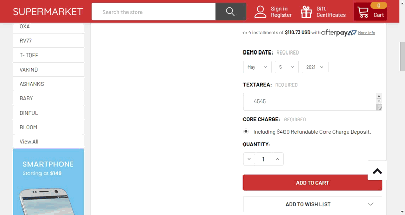

# Add Additional Product To Cart Automatically

This addon allows to add an additional product to cart when a product is added to cart with a specific product option is selected. The additional product cannot be removed when the main product still exists in the cart.




## Install on your BigCommerce Store


Go to **Storefront** > **Script Manager**, click **Create a Script**, choose:

- **Location on page** = `Footer`
- **Select pages where script will be added** = `All pages`
- **Script type** = `Script`

Enter the script below to **Scripts contents**: 

```html
<script>
    window.jQueryTheme = window.jQueryTheme || window.jQuerySupermarket || window.jQuery;
    window.PapathemesAutoAddToCartSettings = {
        conditions: [
            {
                productId: '',
                optionMatch: '',
                optionValueMatch: '',
                productIdToAdd: 378,
            }
        ],
        cartId: '{{cart_id}}',
        graphQLToken: '{{{settings.storefront_api.token}}}',
        checkProductCustomField: '',
        addOneOnly: false, // Add product only 1 qty. Only support if using GraphQL.
        allowRemoval: false,
        debug: false
    };
</script>
<script src="//papathemes.com/content/autoaddtocartaddon/autoaddtocart.YOURDOMAIN.js" async></script>
```

Replace `YOURDOMAIN` by your store's domain name.


### Configuration

- `productId`: Input a product ID if you want to apply for a specific product only.
- `optionMatch`: Input the option name to process only when this option is selected.
- `optionValueMatch`: Input the option value to process only when this option value is selected.
- `productIdToAdd`: Input the additional product ID to add to cart.
- `checkProductCustomField`: A custom field that is used to retrieve the appropriate product to add to cart by product ID or product SKU.
- `addOneOnly`: Whether the product should be added once for the entire cart.
- `allowRemoval`: Whether allow to remove the product from cart.

### Custom Fields template file

Create file `components/products/custom-fields.html` with content below:

```html
<ul>
    {{#each product.custom_fields}}
        <li class="custom-field custom-field--{{pascalcase name}}">
            <span class="custom-field-name">{{name}}</span>
            <span class="custom-field-value">{{{value}}}</span>
        </li>
    {{/each}}
</ul>
```

## Examples

### Configuration for fordiesels.com

```html
<script>
    window.jQueryTheme = window.jQueryTheme || window.jQuerySupermarket || window.jQuery;
    window.PapathemesAutoAddToCartSettings = {
        cartId: '{{cart_id}}',
        conditions: [{
            checkProductCustomField: '__core_charge_product_id',
            optionMatch: 'Accept Core Deposit',
            optionValueMatch: 'Yes'
        }]
    };
</script>
<script src="//papathemes.com/content/autoaddtocartaddon/autoaddtocart.fordiesels.com.js" async></script>
```

### Configuration for vanbind.com

Go to **Storefront** > **Script Manager**, click **Create a Script**, choose:

- **Location on page** = `Footer`
- **Select pages where script will be added** = `All pages`
- **Script type** = `Script`

Enter the script below to **Scripts contents**: 

```html
<script>
    window.jQueryTheme = window.jQueryTheme || window.jQuerySupermarket || window.jQuery;
    window.PapathemesAutoAddToCartSettings = {
        cartId: '{{cart_id}}',
        conditions: [
            {
                checkProductCustomField: '',
                optionMatch: 'Foil & Deboss',
                optionValueMatch: 'Blind Deboss',
                productIdToAdd: 15984
            },
            {
                checkProductCustomField: '',
                optionMatch: 'Foil & Deboss',
                optionValueMatch: 'Foil & Deboss',
                productIdToAdd: 15984
            },
            {
                checkProductCustomField: '',
                optionMatch: 'Artwork Burnishing',
                optionValueMatch: 'Burnished',
                productIdToAdd: 15984
            },
            {
                checkProductCustomField: '',
                optionMatch: 'Foil & Emboss',
                optionValueMatch: 'Foil & Emboss',
                productIdToAdd: 15984
            },
            {
                checkProductCustomField: '',
                optionMatch: 'Foil',
                optionValueMatch: 'Foil',
                productIdToAdd: 15984
            },
            {
                checkProductCustomField: '',
                optionMatch: 'Screen Printing',
                optionValueMatch: '1 Colour',
                productIdToAdd: 15985
            },
            {
                checkProductCustomField: '',
                optionMatch: 'Screen Printing',
                optionValueMatch: '1 Color',
                productIdToAdd: 15985
            },
            {
                checkProductCustomField: '',
                optionMatch: 'Screen Printing',
                optionValueMatch: '2 Colour',
                productIdToAdd: 15985
            }
        ],
        addOneOnly: true,
        allowRemoval: false
    };
</script>
<script src="//papathemes.com/content/autoaddtocartaddon/autoaddtocart.vanbind.com.js" async defer></script>
```
