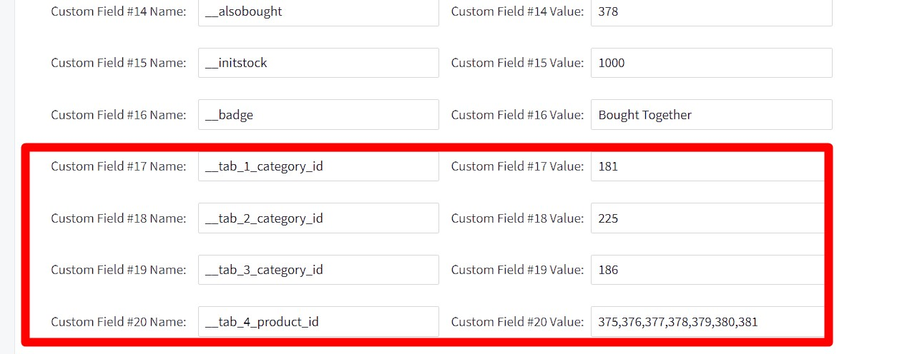

# Display Bundle Product Tabs on a Product Detail Page

To display associated products or products by category on a Product Detail Page (PDP), follow the instructions below:

## Instruction

1. Start by creating custom fields to define the categories or specific product IDs to be shown in each tab. You will create either category-based fields or product ID-based fields.

    **Category-based fields:**

    - Create custom fields `__tab_1_category_id` to `__tab_6_category_id`.
    - Assign a category ID to each field, representing the category from which you want to display products.

    **Product ID-based fields:**

    - Create custom fields `__tab_1_product_id` to `__tab_6_product_id`.
    - Enter the product IDs separated by commas in each field, indicating the specific products you wish to display.

Please refer to the screenshot below for guidance on adding the custom fields.

2. Access the Theme Editor (aka Page Builder).

3. Navigate to the section related to "**Products by Categories**".

4. Locate the tab titles associated with the bundle products and edit them according to your preference. You can modify the titles to provide a clear indication of the content within each tab.

5. Save the changes made in the Theme Editor.

6. On the Product Detail Page (PDP), the bundle product tabs will now be displayed, showcasing the associated products or products from the specified categories.

    Please refer to the below image for an example of how the tabs should appear on the PDP.

    

By following these instructions, you will be able to customize the bundle product tabs on the Product Detail Page, displaying the desired associated or categorized products.