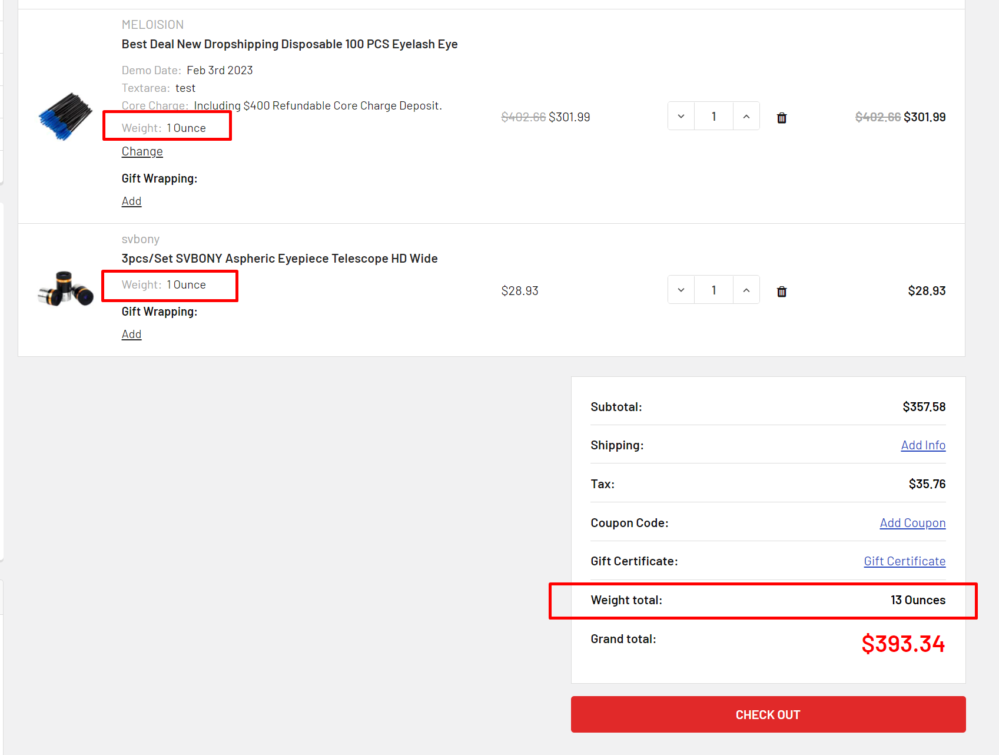

# Display product weight on cart page



```html
<script>
    window.PapathemesCartWeightSettings = {
        graphQLToken: '{{settings.storefront_api.token}}'
    };
</script>
<script src="//papathemes.com/content/cartweight/cart-weight.YOURDOMAIN.js" async defer></script>
```

## Resources

- Github: https://github.com/tvlgiao/bc-cartweight-dev

