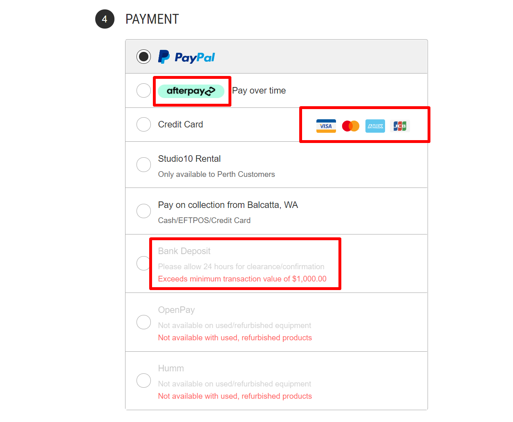

# Checkout Shipping & Payment Method Customizations




This extension allows you to customize the shipping & payment methods displayed on the checkout page:

- Freely change the display order of each shipping & payment methods.
- Freely change each shipping & payment method's name, description, logo and the supported credit card's logo.
- Limit shipping & payment methods by the order total amount. It's possible to limit by minimum or maximum amount.
- Limit shipping & payment methods by product conditions (New, Used or Refurbished).

It does not require editing of your theme files, works with all Stencil / Cornerstone based themes. The code is optimized, asynchronously loaded (parallel loaded), works fast and doesn't affect the speed of your website.

## Install the script to your store

Go to **Storefront** > **Script Manager**, click **Create a Script**, choose:

- **Location on page** = `Footer`
- **Select pages where script will be added** = `Checkout Page`
- **Script type** = `Script`

Enter the script below to **Scripts contents**: 

```html
<script>
    window.PapathemesConditionalShippingPaymentMethodsSettings = {
        cartId: '{{cart_id}}',
        storeHash: '{{settings.store_hash}}',

        // Add more settings here.
        // See 'Settings' section
    };
</script>
<script src="https://d3r059eq9mm6jz.cloudfront.net/microapps/conditional-shipping-payment-methods/main.YOURDOMAIN.js" async defer></script>
```

Replace `YOURDOMAIN` by your domain name, for example `example.com`: `https://d3r059eq9mm6jz.cloudfront.net/microapps/conditional-shipping-payment-methods/main.example.com.js`

## Settings

### cartId

- Your cart ID.
- Must be `'{{cart_id}}'`


### storeHash

- Your store's identify code.
- Must be `'{{settings.store_hash}}'`


### apiUrl
- Our API Endpoint.
- Default: `'https://051ilzoi51.execute-api.us-east-1.amazonaws.com/latest'`


### svgIcons

- Define card icons in SVG format. Edit this setting to add more card icons to your payment method.
- Default:

```js
{
    visa: '<svg height="100" viewBox="0 0 148 100" width="148" xmlns="http://www.w3.org/2000/svg"><g fill="none" fill-rule="evenodd"><path d="M148 84c0 6.6-5.55 12-12 12H12C5.55 96 0 90.6 0 84V12C0 5.4 5.55 0 12 0h124c6.45 0 12 5.4 12 12v72z" fill="#F3F4F4"></path><path d="M0 24V12C0 5.4 5.74 0 12 0h124c6.26 0 12 5.4 12 12v12" fill="#01579F"></path><path d="M148 76v12c0 8.667-5.74 12-12 12H12c-6.26 0-12-3.333-12-12V76" fill="#FAA41D"></path><path d="M55.01 65.267l4.72-29.186h7.546l-4.72 29.19H55.01M89.913 36.8c-1.49-.59-3.85-1.242-6.77-1.242-7.452 0-12.7 3.974-12.73 9.656-.063 4.19 3.756 6.52 6.613 7.918 2.92 1.428 3.913 2.36 3.913 3.633-.04 1.957-2.36 2.857-4.54 2.857-3.014 0-4.628-.465-7.08-1.552l-.996-.466-1.055 6.55c1.77.808 5.03 1.52 8.415 1.553 7.92 0 13.075-3.912 13.137-9.967.03-3.322-1.987-5.868-6.334-7.948-2.64-1.336-4.256-2.236-4.256-3.602.032-1.242 1.367-2.514 4.348-2.514 2.453-.06 4.254.53 5.62 1.12l.684.31L89.91 36.8m10.03 18.13c.62-1.675 3.013-8.165 3.013-8.165-.03.062.62-1.707.994-2.794l.525 2.52s1.428 6.986 1.74 8.445H99.94zm9.317-18.846h-5.84c-1.8 0-3.17.53-3.945 2.424L88.265 65.27h7.918s1.305-3.6 1.585-4.377h9.687c.217 1.024.9 4.377.9 4.377h6.987l-6.082-29.19zm-60.555 0l-7.39 19.904-.807-4.037c-1.37-4.652-5.653-9.713-10.435-12.23l6.77 25.52h7.98L56.68 36.09H48.7" fill="#3B5CAA"></path><path d="M34.454 36.08H22.312l-.124.59c9.47 2.423 15.744 8.26 18.32 15.277L37.87 38.534c-.436-1.863-1.77-2.39-3.416-2.453" fill="#F8A51D"></path></g></svg>',
    mastercard: '<svg viewBox="0 0 131.39 86.9" xmlns="http://www.w3.org/2000/svg"><path d="M48.37 15.14h34.66v56.61H48.37z" fill="#ff5f00"></path><path d="M51.94 43.45a35.94 35.94 0 0113.75-28.3 36 36 0 100 56.61 35.94 35.94 0 01-13.75-28.31z" fill="#eb001b"></path><path d="M120.5 65.76V64.6h.5v-.24h-1.19v.24h.47v1.16zm2.31 0v-1.4h-.36l-.42 1-.42-1h-.36v1.4h.26V64.7l.39.91h.27l.39-.91v1.06zM123.94 43.45a36 36 0 01-58.25 28.3 36 36 0 000-56.61 36 36 0 0158.25 28.3z" fill="#f79e1b"></path></svg>',
    amex: '<svg height="104" viewBox="0 0 156 104" width="156" xmlns="http://www.w3.org/2000/svg"><g fill="none" fill-rule="evenodd"><path d="M144 104H12c-6.15 0-12-5.85-12-12V12C0 5.85 5.85 0 12 0h132c6.15 0 12 5.85 12 12v80c0 6.15-5.85 12-12 12z" fill="#60C7EE"></path><g fill="#FFF"><path d="M95.05 46.532v3.68h12.93v4.723H95.05V59.5h12.79l5.244-6.824-4.673-6.144H95.05m-59.707 9.382h5.906l-2.97-8.324-2.94 8.324"></path><path d="M128.833 52.77l11.29-15.125h-19.067l-2.536 3.9-2.608-3.9h-46.59l-1.254 4.224-1.264-4.227H31.27L17.72 68.687h17.326l1.31-3.822h3.824l1.345 3.822h73.594l3.28-4.594 3.28 4.594h19.36l-4.867-6.343-7.342-9.574zM83.185 64.744H76.38v-17.66l-5.243 17.66h-6.16l-5.233-17.66v17.66H44.318l-1.345-3.823H33.54l-1.312 3.826h-8.483L33.85 41.588h9.065L52.94 64.56V41.59h10.927l4.214 14.09 4.187-14.09h10.92v23.156zm40.524 0l-5.31-7.44-5.31 7.44H86.72V41.588h27.085l4.76 7.124 4.63-7.124h9.062l-8.37 11.215 9.16 11.94h-9.338z"></path></g></g></svg>',
    jcb: '<svg clip-rule="evenodd" fill-rule="evenodd" stroke-linejoin="round" stroke-miterlimit="1.4" viewBox="0 0 480 301" xmlns="http://www.w3.org/2000/svg"><path d="M444 0H24C12 0 0 12 0 24v240.1c0 24 12 36 36 36h408c24 0 36-12 36-36v-228C480 12 468 0 444 0z" fill="#f4f4f4"></path><path d="M314.8 174.9h21.5l2.7-.2c4-.8 7.6-4.5 7.6-9.6 0-5-3.5-8.6-7.6-9.6l-2.7-.3h-21.5V175z" fill="#469951" fill-rule="nonzero"></path><path d="M333.9 39.2a37.3 37.3 0 0 0-37.3 37.2v38.7h52.6c1.2 0 2.7 0 3.7.2 11.9.7 20.7 6.8 20.7 17.4 0 8.4-6 15.6-17 17v.4c12 .8 21.3 7.6 21.3 18 0 11.3-10.3 18.7-23.8 18.7h-57.7v75.7h54.7a37.3 37.3 0 0 0 37.2-37.3v-186H334z" fill="#469951" fill-rule="nonzero"></path><path d="M343.9 135.2c0-5-3.5-8.2-7.6-8.8l-2-.2h-19.5v18h19.5c.3 0 1.4 0 2-.2 4.1-.6 7.6-3.9 7.6-8.8z" fill="#469951" fill-rule="nonzero"></path><path d="M128 39.2a37.3 37.3 0 0 0-37.3 37.2v92a73.7 73.7 0 0 0 32.2 8.3c12.8 0 19.8-7.7 19.8-18.4V115h32v43.2c0 16.8-10.5 30.5-46 30.5-21.4 0-38.2-4.7-38.2-4.7v78.4h54.7a37.3 37.3 0 0 0 37.2-37.3V39.2H128z" fill="#245797" fill-rule="nonzero"></path><path d="M231 39.2a37.3 37.3 0 0 0-37.3 37.2v48.8c9.4-8 25.8-13.1 52.2-12 14 .7 29.2 4.6 29.2 4.6v15.8a70.9 70.9 0 0 0-28.2-8.2c-20-1.5-32.1 8.4-32.1 25.5 0 17.4 12 27.3 32 25.6a74.3 74.3 0 0 0 28.3-8.2v15.8s-15 3.9-29.2 4.5c-26.4 1.2-42.8-3.9-52.2-11.9v86h54.6a37.3 37.3 0 0 0 37.3-37.3V39.2h-54.7z" fill="#ca4638" fill-rule="nonzero"></path></svg>',
}
```

### paymentMethods


- Configure how to display your shipping & payment methods.
- Default:

```js
paymentMethods: {
    squarev2: {
        title: 'Credit Card',
        icons: ['visa', 'mastercard', 'amex', 'jcb'],
        order: 3,
    },
    paypalexpress: {
        titleImg: 'https://cdn11.bigcommerce.com/r-ee66862ae166200c57f1b2929aa2864d113b10b0/img/payment-providers/paypal_commerce_logo.svg',
        titleImgAlt: 'Paypal',
        order: 1,
        couponsDisable: ['ES6TG2AIL'],
        skusDisable: ['alsobought-child-4'],
        productOptionsDisable: [
            {
                name: 'Color',
                value: 'Red',
            },
        ],
    },
    paypalcommerce: {
        titleImg: 'https://cdn11.bigcommerce.com/r-ee66862ae166200c57f1b2929aa2864d113b10b0/img/payment-providers/paypal_commerce_logo.svg',
        titleImgAlt: 'Paypal',
        order: 1,
        preorderDisable: false,
    },
    'afterpay-PAY_BY_INSTALLMENT': {
        title: 'Pay over time',
        titleImg: 'https://cdn11.bigcommerce.com/r-ee66862ae166200c57f1b2929aa2864d113b10b0/img/payment-providers/afterpay-badge-blackonmint.png',
        titleImgAlt: 'Pay over time',
        order: 2,
        maxAmount: 2000,
    },
    bankdeposit: {
        title: 'Bank Deposit',
        description: 'Please allow 24 hours for clearance/confirmation',
        order: 4,
        minAmount: 1000,
    },
    cheque: {
        title: 'OpenPay',
        description: 'Not available on used/refurbished equipment',
        order: 5,
        productConditionsDisable: ['Used', 'Refurbished'],
    },
    cod: {
        title: 'Studio10 Rental',
        description: 'Only available to Perth Customers',
        order: 6,
        customerGroupDisable: ['Guest', 'USA Wholesale'],
    },
    instore: {
        title: 'Pay on collection from Balcatta, WA',
        description: 'Cash/EFTPOS/Credit Card',
        enableForCategoryIds: [123, 456],
        order: 7,
    },
    moneyorder: {
        title: 'Humm',
        description: 'Not available on used/refurbished equipment',
        order: 8,
        productConditionsDisable: ['Used', 'Refurbished'],
    },
    studio19: {
    },
},
shippingMethods: {
    'Pickup In Store': {
        order: 1,
        couponsDisable: ['ES6TG2AIL'],
        skusDisable: ['alsobought-child-4'],
        productOptionsDisable: [
            {
                name: 'Color',
                value: 'Red',
            },
        ],
    },
    'FEDEX by Customer': {
        order: 2,
        description: 'Please allow 24 hours for clearance/confirmation',
        minAmount: 1000,
    },
    'Flat Rate': {
        order: 3,
    }
},
```

**Payment methods list:**

- `squarev2`: Default Credit Card
- `paypalexpress`: PayPal
- `paypalcommerce`: PayPal
- `afterpay-PAY_BY_INSTALLMENT`: AfterPay
- `bankdeposit`: Bank Deposit
- `cheque`: Payment by Cheque
- `cod`: Cash on Delivery
- `instore`: In-Store Payment
- `moneyorder`: Money Order


**Shipping methods list:**

- Pickup In Store
- FEDEX by Customer
- Flat Rate
- _(shipping method name)_

Please contact us if any of your shipping or payment method is not listed above.

**Settings for each shipping/payment method:**

- `title`: Shipping/Payment method name.
- `titleImg`: Shipping/Payment method image (Optional).
- `titleImgAlt`: Alt text for the shipping/payment method image (Optional).
- `icons`: Array of card icons displayed (Optional). Example: `['visa', 'mastercard', 'amex', 'jcb']`.
- `order`: Sort order number (Optional).
- `minAmount`: Limit by minimum order amount (Optional). Example: `100`.
- `maxAmount`: Limit by maximum  order amount (Optional). Example: `1000`.
- `productConditionsDisable`: Disable for specific product conditions (Optional). Example: `['Used', 'Refurbished']`.
- `couponsDisable`: Disable for specific coupon codes. Example: `['ES6TG2AIL']`.
- `skusDisable`: Disable for specific SKUs or variant SKUs. Example: `['alsobought-child-4']`.
- `productOptionsDisable`: Disable for specific product options. Example:
```js
productOptionsDisable: [
    {
        name: 'Color',
        value: 'Red',
    },
],
```
- `customerGroupDisable`: Disable for specific customer groups. Example: `['Guest', 'USA Wholesale']`.
- `enableForCategoryIds`: Enable for specific product categories. Example: `[123, 456]`.


### paymentMethodLabelTemplate

- Template for displaying each payment method.
- Default:

```html
<label>
    <%#titleImg%>
        " class="paymentProviderHeader-img" data-test="payment-method-logo" src="<%.%>">
    <%/titleImg%>
    <%#title%>
        <span class="paymentProviderHeader-name" data-test="payment-method-name"><%&.%></span>
    <%/title%>
    <div class="paymentProviderHeader-cc">
        <ul class="creditCardTypes-list">
            <%#icons%>
                <li class="creditCardTypes-list-item"><span class="cardIcon"><div class="icon cardIcon-icon icon--medium" data-test="credit-card-icon-<%code%>"><%&svg%></div></span></li>
            <%/icons%>
        </ul>
    </div>
    <%#description%>
        <span class="paymentProviderHeader-description" data-test="payment-method-description"><%&.%></span>
    <%/description%>
    <%#errors%>
        <span class="paymentProviderHeader-error" data-test="payment-method-description"><%&.%></span>
    <%/errors%>
</label>
```

### shippingMethodLabelDescTemplate

- Template for display each shipping method.
- Default:

```html
<span class="shippingOption-desc">
    <%#titleImg%>
        " class="shippingProviderHeader-img" data-test="shipping-method-logo" src="<%.%>">
    <%/titleImg%>
    <%#title%>
        <span class="shippingProviderHeader-name" data-test="shipping-method-name"><%&.%></span>
    <%/title%>
    <%#description%>
        <span class="shippingProviderHeader-description" data-test="shipping-method-description"><%&.%></span>
    <%/description%>
    <%#errors%>
        <span class="shippingProviderHeader-error" data-test="shipping-method-description"><%&.%></span>
    <%/errors%>
</span>
```


### txtMaxAmountError

- Error message when exceeding the maximum amount.
- Default: `'Exceeds maximum transaction value of {amount}'`


### txtMinAmountError
- Error message when exceeding the minimum amount.
- Default: `'Exceeds minimum transaction value of {amount}'`

### txtConditionProductError

- Error message when product condition is not unavailable for the payment method.
- Default: `'Not available with {condition} products'`


### txtCategoryError

- Error message when categories are not matched.
- Default: `'Not available for some products in your cart'`

### txtPreorderError

- Error message when preorder is matched.
- Default: `'Not available for pre-order products'`


### txtCustomerGroupError

- Error message when customer group is matched.
- Default: `'Not available for {customerGroup} customers'`.

### txtCouponError

- Error message when coupon code is matched.
- Default: `'Not available for coupon {coupon}'`.


### txtSkuError

- Error message when SKU is matched.
- Default: `'Not available for sku {sku}'`


### txtProductOptionError

- Error message when product option is matched.
- Default: `Not available for {option}'`


## Examples


### Recommended settings example:

```html
<script>
    window.PapathemesConditionalShippingPaymentMethodsSettings = {
        cartId: '{{cart_id}}',
        storeHash: '{{settings.store_hash}}',
        paymentMethods: {
            squarev2: {
                title: 'Credit Card',
                icons: ['visa', 'mastercard', 'amex', 'jcb'],
                order: 3,
            },
            paypalexpress: {
                titleImg: 'https://cdn11.bigcommerce.com/r-ee66862ae166200c57f1b2929aa2864d113b10b0/img/payment-providers/paypal_commerce_logo.svg',
                titleImgAlt: 'Paypal',
                order: 1,
                maxAmount: 1000,
            },
            paypalcommerce: {
                titleImg: 'https://cdn11.bigcommerce.com/r-ee66862ae166200c57f1b2929aa2864d113b10b0/img/payment-providers/paypal_commerce_logo.svg',
                titleImgAlt: 'Paypal',
                order: 1,
                maxAmount: 1000,
            },
            'afterpay-PAY_BY_INSTALLMENT': {
                title: 'Pay over time',
                titleImg: 'https://cdn11.bigcommerce.com/r-ee66862ae166200c57f1b2929aa2864d113b10b0/img/payment-providers/afterpay-badge-blackonmint.png',
                titleImgAlt: 'Pay over time',
                order: 2,
                maxAmount: 2000,
            },
            bankdeposit: {
                title: 'Bank Deposit',
                description: 'Please allow 24 hours for clearance/confirmation',
                order: 4,
                minAmount: 1000,
            },
            cheque: {
                title: 'OpenPay',
                description: 'Not available on used/refurbished equipment',
                order: 5,
                productConditionsDisable: ['Used', 'Refurbished'],
            },
            cod: {
                title: 'Studio10 Rental',
                description: 'Only available to Perth Customers',
                order: 6,
                customerGroupDisable: ['Guest', 'USA Wholesale'],
            },
            instore: {
                title: 'Pay on collection from Balcatta, WA',
                description: 'Cash/EFTPOS/Credit Card',
                enableForCategoryIds: [123, 456],
                order: 7,
            },
            moneyorder: {
                title: 'Humm',
                description: 'Not available on used/refurbished equipment',
                order: 8,
                productConditionsDisable: ['Used', 'Refurbished'],
                preorderDisable: false,
            },
            studio19: {
            },
        },
        paymentMethodLabelTemplate: `
            <label>
                <%#titleImg%>
                    " class="paymentProviderHeader-img" data-test="payment-method-logo" src="<%.%>">
                <%/titleImg%>
                <%#title%>
                    <span class="paymentProviderHeader-name" data-test="payment-method-name"><%&.%></span>
                <%/title%>
                <div class="paymentProviderHeader-cc">
                    <ul class="creditCardTypes-list">
                        <%#icons%>
                            <li class="creditCardTypes-list-item"><span class="cardIcon"><div class="icon cardIcon-icon icon--medium" data-test="credit-card-icon-<%code%>"><%&svg%></div></span></li>
                        <%/icons%>
                    </ul>
                </div>
                <%#description%>
                    <span class="paymentProviderHeader-description" data-test="payment-method-description"><%&.%></span>
                <%/description%>
                <%#errors%>
                    <span class="paymentProviderHeader-error" data-test="payment-method-description"><%&.%></span>
                <%/errors%>
            </label>
        `,
        shippingMethods: {
            'Pickup In Store': {
                order: 1,
                couponsDisable: ['ES6TG2AIL'],
                skusDisable: ['alsobought-child-4'],
                productOptionsDisable: [
                    {
                        name: 'Color',
                        value: 'Red',
                    },
                ],
            },
            'FEDEX by Customer': {
                order: 2,
                description: 'Please allow 24 hours for clearance/confirmation',
                minAmount: 1000,
            },
            'Flat Rate': {
                order: 3,
            }
        },
    };
</script>
```


### Full settings example:

```html
<script>
    window.PapathemesConditionalShippingPaymentMethodsSettings = {
        cartId: '{{cart_id}}',
        storeHash: '{{settings.store_hash}}',
        svgIcons: {
            visa: '<svg height="100" viewBox="0 0 148 100" width="148" xmlns="http://www.w3.org/2000/svg"><g fill="none" fill-rule="evenodd"><path d="M148 84c0 6.6-5.55 12-12 12H12C5.55 96 0 90.6 0 84V12C0 5.4 5.55 0 12 0h124c6.45 0 12 5.4 12 12v72z" fill="#F3F4F4"></path><path d="M0 24V12C0 5.4 5.74 0 12 0h124c6.26 0 12 5.4 12 12v12" fill="#01579F"></path><path d="M148 76v12c0 8.667-5.74 12-12 12H12c-6.26 0-12-3.333-12-12V76" fill="#FAA41D"></path><path d="M55.01 65.267l4.72-29.186h7.546l-4.72 29.19H55.01M89.913 36.8c-1.49-.59-3.85-1.242-6.77-1.242-7.452 0-12.7 3.974-12.73 9.656-.063 4.19 3.756 6.52 6.613 7.918 2.92 1.428 3.913 2.36 3.913 3.633-.04 1.957-2.36 2.857-4.54 2.857-3.014 0-4.628-.465-7.08-1.552l-.996-.466-1.055 6.55c1.77.808 5.03 1.52 8.415 1.553 7.92 0 13.075-3.912 13.137-9.967.03-3.322-1.987-5.868-6.334-7.948-2.64-1.336-4.256-2.236-4.256-3.602.032-1.242 1.367-2.514 4.348-2.514 2.453-.06 4.254.53 5.62 1.12l.684.31L89.91 36.8m10.03 18.13c.62-1.675 3.013-8.165 3.013-8.165-.03.062.62-1.707.994-2.794l.525 2.52s1.428 6.986 1.74 8.445H99.94zm9.317-18.846h-5.84c-1.8 0-3.17.53-3.945 2.424L88.265 65.27h7.918s1.305-3.6 1.585-4.377h9.687c.217 1.024.9 4.377.9 4.377h6.987l-6.082-29.19zm-60.555 0l-7.39 19.904-.807-4.037c-1.37-4.652-5.653-9.713-10.435-12.23l6.77 25.52h7.98L56.68 36.09H48.7" fill="#3B5CAA"></path><path d="M34.454 36.08H22.312l-.124.59c9.47 2.423 15.744 8.26 18.32 15.277L37.87 38.534c-.436-1.863-1.77-2.39-3.416-2.453" fill="#F8A51D"></path></g></svg>',
            mastercard: '<svg viewBox="0 0 131.39 86.9" xmlns="http://www.w3.org/2000/svg"><path d="M48.37 15.14h34.66v56.61H48.37z" fill="#ff5f00"></path><path d="M51.94 43.45a35.94 35.94 0 0113.75-28.3 36 36 0 100 56.61 35.94 35.94 0 01-13.75-28.31z" fill="#eb001b"></path><path d="M120.5 65.76V64.6h.5v-.24h-1.19v.24h.47v1.16zm2.31 0v-1.4h-.36l-.42 1-.42-1h-.36v1.4h.26V64.7l.39.91h.27l.39-.91v1.06zM123.94 43.45a36 36 0 01-58.25 28.3 36 36 0 000-56.61 36 36 0 0158.25 28.3z" fill="#f79e1b"></path></svg>',
            amex: '<svg height="104" viewBox="0 0 156 104" width="156" xmlns="http://www.w3.org/2000/svg"><g fill="none" fill-rule="evenodd"><path d="M144 104H12c-6.15 0-12-5.85-12-12V12C0 5.85 5.85 0 12 0h132c6.15 0 12 5.85 12 12v80c0 6.15-5.85 12-12 12z" fill="#60C7EE"></path><g fill="#FFF"><path d="M95.05 46.532v3.68h12.93v4.723H95.05V59.5h12.79l5.244-6.824-4.673-6.144H95.05m-59.707 9.382h5.906l-2.97-8.324-2.94 8.324"></path><path d="M128.833 52.77l11.29-15.125h-19.067l-2.536 3.9-2.608-3.9h-46.59l-1.254 4.224-1.264-4.227H31.27L17.72 68.687h17.326l1.31-3.822h3.824l1.345 3.822h73.594l3.28-4.594 3.28 4.594h19.36l-4.867-6.343-7.342-9.574zM83.185 64.744H76.38v-17.66l-5.243 17.66h-6.16l-5.233-17.66v17.66H44.318l-1.345-3.823H33.54l-1.312 3.826h-8.483L33.85 41.588h9.065L52.94 64.56V41.59h10.927l4.214 14.09 4.187-14.09h10.92v23.156zm40.524 0l-5.31-7.44-5.31 7.44H86.72V41.588h27.085l4.76 7.124 4.63-7.124h9.062l-8.37 11.215 9.16 11.94h-9.338z"></path></g></g></svg>',
            jcb: '<svg clip-rule="evenodd" fill-rule="evenodd" stroke-linejoin="round" stroke-miterlimit="1.4" viewBox="0 0 480 301" xmlns="http://www.w3.org/2000/svg"><path d="M444 0H24C12 0 0 12 0 24v240.1c0 24 12 36 36 36h408c24 0 36-12 36-36v-228C480 12 468 0 444 0z" fill="#f4f4f4"></path><path d="M314.8 174.9h21.5l2.7-.2c4-.8 7.6-4.5 7.6-9.6 0-5-3.5-8.6-7.6-9.6l-2.7-.3h-21.5V175z" fill="#469951" fill-rule="nonzero"></path><path d="M333.9 39.2a37.3 37.3 0 0 0-37.3 37.2v38.7h52.6c1.2 0 2.7 0 3.7.2 11.9.7 20.7 6.8 20.7 17.4 0 8.4-6 15.6-17 17v.4c12 .8 21.3 7.6 21.3 18 0 11.3-10.3 18.7-23.8 18.7h-57.7v75.7h54.7a37.3 37.3 0 0 0 37.2-37.3v-186H334z" fill="#469951" fill-rule="nonzero"></path><path d="M343.9 135.2c0-5-3.5-8.2-7.6-8.8l-2-.2h-19.5v18h19.5c.3 0 1.4 0 2-.2 4.1-.6 7.6-3.9 7.6-8.8z" fill="#469951" fill-rule="nonzero"></path><path d="M128 39.2a37.3 37.3 0 0 0-37.3 37.2v92a73.7 73.7 0 0 0 32.2 8.3c12.8 0 19.8-7.7 19.8-18.4V115h32v43.2c0 16.8-10.5 30.5-46 30.5-21.4 0-38.2-4.7-38.2-4.7v78.4h54.7a37.3 37.3 0 0 0 37.2-37.3V39.2H128z" fill="#245797" fill-rule="nonzero"></path><path d="M231 39.2a37.3 37.3 0 0 0-37.3 37.2v48.8c9.4-8 25.8-13.1 52.2-12 14 .7 29.2 4.6 29.2 4.6v15.8a70.9 70.9 0 0 0-28.2-8.2c-20-1.5-32.1 8.4-32.1 25.5 0 17.4 12 27.3 32 25.6a74.3 74.3 0 0 0 28.3-8.2v15.8s-15 3.9-29.2 4.5c-26.4 1.2-42.8-3.9-52.2-11.9v86h54.6a37.3 37.3 0 0 0 37.3-37.3V39.2h-54.7z" fill="#ca4638" fill-rule="nonzero"></path></svg>',
        },
        paymentMethods: {
            squarev2: {
                title: 'Credit Card',
                icons: ['visa', 'mastercard', 'amex', 'jcb'],
                order: 3,
            },
            paypalexpress: {
                titleImg: 'https://cdn11.bigcommerce.com/r-ee66862ae166200c57f1b2929aa2864d113b10b0/img/payment-providers/paypal_commerce_logo.svg',
                titleImgAlt: 'Paypal',
                order: 1,
                couponsDisable: ['ES6TG2AIL'],
                skusDisable: ['alsobought-child-4'],
                productOptionsDisable: [
                    {
                        name: 'Color',
                        value: 'Red',
                    },
                ],
            },
            paypalcommerce: {
                titleImg: 'https://cdn11.bigcommerce.com/r-ee66862ae166200c57f1b2929aa2864d113b10b0/img/payment-providers/paypal_commerce_logo.svg',
                titleImgAlt: 'Paypal',
                order: 1,
                preorderDisable: false,
            },
            'afterpay-PAY_BY_INSTALLMENT': {
                title: 'Pay over time',
                titleImg: 'https://cdn11.bigcommerce.com/r-ee66862ae166200c57f1b2929aa2864d113b10b0/img/payment-providers/afterpay-badge-blackonmint.png',
                titleImgAlt: 'Pay over time',
                order: 2,
                maxAmount: 2000,
            },
            bankdeposit: {
                title: 'Bank Deposit',
                description: 'Please allow 24 hours for clearance/confirmation',
                order: 4,
                minAmount: 1000,
            },
            cheque: {
                title: 'OpenPay',
                description: 'Not available on used/refurbished equipment',
                order: 5,
                productConditionsDisable: ['Used', 'Refurbished'],
            },
            cod: {
                title: 'Studio10 Rental',
                description: 'Only available to Perth Customers',
                order: 6,
                customerGroupDisable: ['Guest', 'USA Wholesale'],
            },
            instore: {
                title: 'Pay on collection from Balcatta, WA',
                description: 'Cash/EFTPOS/Credit Card',
                enableForCategoryIds: [123, 456],
                order: 7,
            },
            moneyorder: {
                title: 'Humm',
                description: 'Not available on used/refurbished equipment',
                order: 8,
                productConditionsDisable: ['Used', 'Refurbished'],
            },
            studio19: {
            },
        },
        paymentMethodLabelTemplate: `
            <label>
                <%#titleImg%>
                    " class="paymentProviderHeader-img" data-test="payment-method-logo" src="<%.%>">
                <%/titleImg%>
                <%#title%>
                    <span class="paymentProviderHeader-name" data-test="payment-method-name"><%&.%></span>
                <%/title%>
                <div class="paymentProviderHeader-cc">
                    <ul class="creditCardTypes-list">
                        <%#icons%>
                            <li class="creditCardTypes-list-item"><span class="cardIcon"><div class="icon cardIcon-icon icon--medium" data-test="credit-card-icon-<%code%>"><%&svg%></div></span></li>
                        <%/icons%>
                    </ul>
                </div>
                <%#description%>
                    <span class="paymentProviderHeader-description" data-test="payment-method-description"><%&.%></span>
                <%/description%>
                <%#errors%>
                    <span class="paymentProviderHeader-error" data-test="payment-method-description"><%&.%></span>
                <%/errors%>
            </label>
        `,
        shippingMethods: {
            'Pickup In Store': {
                order: 1,
                couponsDisable: ['ES6TG2AIL'],
                skusDisable: ['alsobought-child-4'],
                productOptionsDisable: [
                    {
                        name: 'Color',
                        value: 'Red',
                    },
                ],
            },
            'FEDEX by Customer': {
                order: 2,
                description: 'Please allow 24 hours for clearance/confirmation',
                minAmount: 1000,
            },
            'Flat Rate': {
                order: 3,
            }
        },
        shippingMethodLabelDescTemplate: `
            <span class="shippingOption-desc">
                <%#titleImg%>
                    " class="shippingProviderHeader-img" data-test="shipping-method-logo" src="<%.%>">
                <%/titleImg%>
                <%#title%>
                    <span class="shippingProviderHeader-name" data-test="shipping-method-name"><%&.%></span>
                <%/title%>
                <%#description%>
                    <span class="shippingProviderHeader-description" data-test="shipping-method-description"><%&.%></span>
                <%/description%>
                <%#errors%>
                    <span class="shippingProviderHeader-error" data-test="shipping-method-description"><%&.%></span>
                <%/errors%>
            </span>
        `,
        enableStudio19: false,
        txtMaxAmountError: 'Exceeds maximum transaction value of {amount}',
        txtMinAmountError: 'Exceeds minimum transaction value of {amount}',
        txtConditionProductError: 'Not available with {condition} products',
        txtCategoryError: 'Not available for some products in your cart',
        txtPreorderError: 'Not available for pre-order products',
        txtCustomerGroupError: 'Not available for {customerGroup} customers',
        txtCouponError: 'Not available for coupon {coupon}',
        txtSkuError: 'Not available for sku {sku}',
        txtProductOptionError: 'Not available for {option}',
    };
</script>
```

### For smartwheel.ca

Go to **Storefront** > **Script Manager**, click **Create a Script**, choose:

- **Location on page** = `Footer`
- **Select pages where script will be added** = `Checkout Page`
- **Script type** = `Script`

Enter the script below to **Scripts contents**:

```html
<script>
    window.PapathemesConditionalShippingPaymentMethodsSettings = {
        // ====================================================================
        // Configuration for Payment Methods
        // ====================================================================
        paymentMethods: {

            // ----------------------------------------------------------------
            // Configuration for Credit Card by Braintree
            // ----------------------------------------------------------------
            braintree: {
                // Disallow for customer groups:
                customerGroupEnable: ['Guest', 'All', 'Default', 'L0 Consumer', 'L1 Consumer'],

                // Disallow for skus:
                skusDisable: ['1ZR-11X-72V', '1DT-X2U-3240WH'],

                // Disallow for coupons:
                couponsDisable: ['Local4894'], // Disallow for "Local4894" coupon

                // Disallow for modifiers:
                productOptionsDisable: [
                    {
                        name: 'Flash Sale - Save Big',
                        value: 'DIY - Parts only limited warranty - Save Big!',
                    },
                ],
            },

            // ----------------------------------------------------------------
            // Configuration for Credit Card by Stripe
            // ----------------------------------------------------------------
            'stripeupe-card': {
                // Disallow for customer groups:
                customerGroupEnable: ['Guest', 'All', 'Default', 'L0 Consumer', 'L1 Consumer'],

                // Disallow for skus:
                skusDisable: ['1ZR-11X-72V', '1DT-X2U-3240WH'],

                // Disallow for coupons:
                couponsDisable: ['Local4894'], // Disallow for "Local4894" coupon

                // Disallow for modifiers:
                productOptionsDisable: [
                    {
                        name: 'Flash Sale - Save Big',
                        value: 'DIY - Parts only limited warranty - Save Big!',
                    },
                ],
            },

            // ----------------------------------------------------------------
            // Configuration for PayPal
            // ----------------------------------------------------------------
            paypalcommerce: {
                // Disallow for customer groups:
                customerGroupEnable: ['Guest', 'All', 'Default', 'L0 Consumer', 'L1 Consumer'],

                // Disallow for skus:
                couponsDisable: ['Local4894'], // Disallow for "Local4894" coupon
            },

            // ----------------------------------------------------------------
            // Configuration for Bank Deposit
            // ----------------------------------------------------------------
            bankdeposit: {
                // Disallow for customer groups:
                customerGroupEnable: ['L2 Consumer', 'L3 Consumer', 'L4 Consumer'],

                // Disallow for categories:
                disableForCategoryIds: [226], // Disallow for "Taubik" category
            },

            // ----------------------------------------------------------------
            // Configuration for Sezzle
            // ----------------------------------------------------------------
            sezzle: {
                // Disallow for customer groups:
                customerGroupEnable: ['Guest', 'All', 'Default', 'L0 Consumer', 'L1 Consumer'],

                // Disallow for skus:
                skusDisable: ['1ZR-11X-72V', '1DT-X2U-3240WH'],

                // Disallow for coupons:
                couponsDisable: ['Local4894'], // Disallow for "Local4894" coupon

                // Disallow for modifiers:
                productOptionsDisable: [
                    {
                        name: 'Flash Sale - Save Big',
                        value: 'DIY - Parts only limited warranty - Save Big!',
                    },
                ],
            },

            // ----------------------------------------------------------------
            // Configuration for Gift Certificate
            // ----------------------------------------------------------------
            bigcommerce_gift_certificate: {
            },

            // ----------------------------------------------------------------
            // Configuration for Store Credit
            // ----------------------------------------------------------------
            bigcommerce_store_credit: {
            }
        },

        // ====================================================================
        // Configuration for Shipping Methods
        // ====================================================================
        shippingMethods: {

            // ----------------------------------------------------------------
            // Configuration for Free Shipping
            // ----------------------------------------------------------------
            'Free Shipping': {
                // Disallow for customer groups:
                customerGroupDisable: ['L2 Consumer', 'L3 Consumer', 'L4 Consumer'],

                // Disallow for skus:
                skusDisable: ['1ZR-11X-72V', '1DT-X2U-3240WH'],

                // Disallow for categories:
                disableForCategoryIds: [226], // Disallow for "Taubik" category

                // Disallow for coupons:
                couponsDisable: ['Local4894'], // Disallow for "Local4894" coupon

                // Disallow for modifiers:
                productOptionsDisable: [
                    {
                        name: 'Flash Sale - Save Big',
                        value: 'DIY - Parts only limited warranty - Save Big!',
                    },
                ],
            },

            // ----------------------------------------------------------------
            // Configuration for Pickup In Store - Burlington, ON
            // ----------------------------------------------------------------
            'Pickup In Store - Burlington, ON': {
            },

            // ----------------------------------------------------------------
            // Configuration for Pickup / Collect - Etobicoke, ON
            // ----------------------------------------------------------------
            'Pickup / Collect - Etobicoke, ON': {
            },

            // ----------------------------------------------------------------
            // Configuration for FixedShipping
            // ----------------------------------------------------------------
            FixedShipping: {
                // Disallow for coupons:
                couponsDisable: ['Local4894'], // Disallow for "Local4894" coupon
            },

            // ----------------------------------------------------------------
            // Configuration for UPS--Standard
            // ----------------------------------------------------------------
            'UPS--Standard': {
                // Disallow for coupons:
                couponsDisable: ['Local4894'], // Disallow for "Local4894" coupon
            },

            // ----------------------------------------------------------------
            // Configuration for UPS--Expedited
            // ----------------------------------------------------------------
            'Canpar--Ground': {
                // Disallow for coupons:
                couponsDisable: ['Local4894'], // Disallow for "Local4894" coupon
            },

            // ----------------------------------------------------------------
            // Configuration for Federal Express--Fedex Ground
            // ----------------------------------------------------------------
            'Federal Express--Fedex Ground': {
                // Disallow for coupons:
                couponsDisable: ['Local4894'], // Disallow for "Local4894" coupon
            },

            // ----------------------------------------------------------------
            // Configuration for Canpar--Express Parcel
            // ----------------------------------------------------------------
            'Canpar--Express Parcel': {
                // Disallow for coupons:
                couponsDisable: ['Local4894'], // Disallow for "Local4894" coupon
            }
        },

        // !!!!!!!!!!!!!!!!!!!!!!!!!!!
        // DO NOT EDIT BELOW SETTINGS:
        // !!!!!!!!!!!!!!!!!!!!!!!!!!!
        cartId: '{{cart_id}}',
        storeHash: '{{settings.store_hash}}',
        graphQLToken: '{{settings.storefront_api.token}}',
        apiUrl: '',
        hideDisabledMethods: true,
        debug: true,
    };
</script>
<script src="https://d3r059eq9mm6jz.cloudfront.net/microapps/conditional-shipping-payment-methods/main.smartwheel.ca.js" async defer></script>
```
