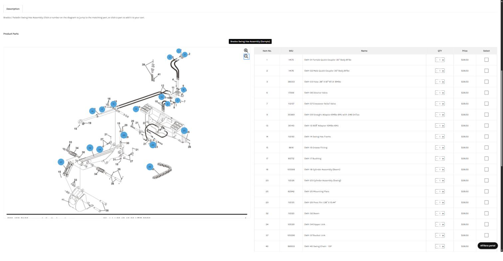
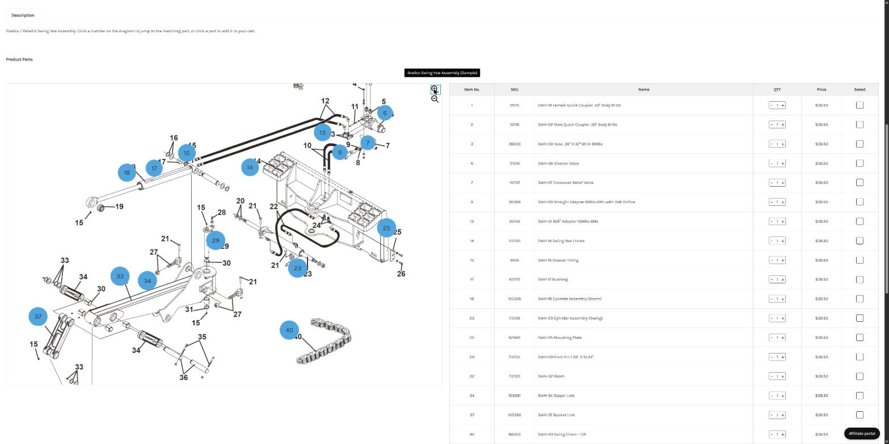
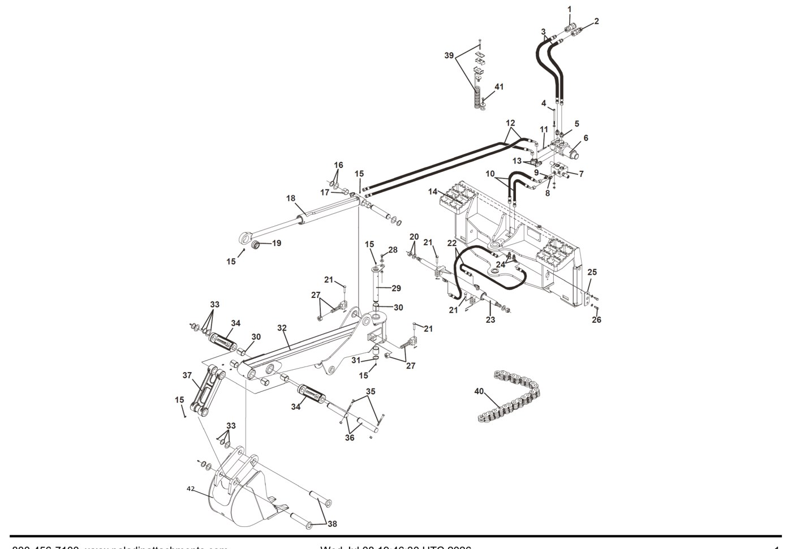
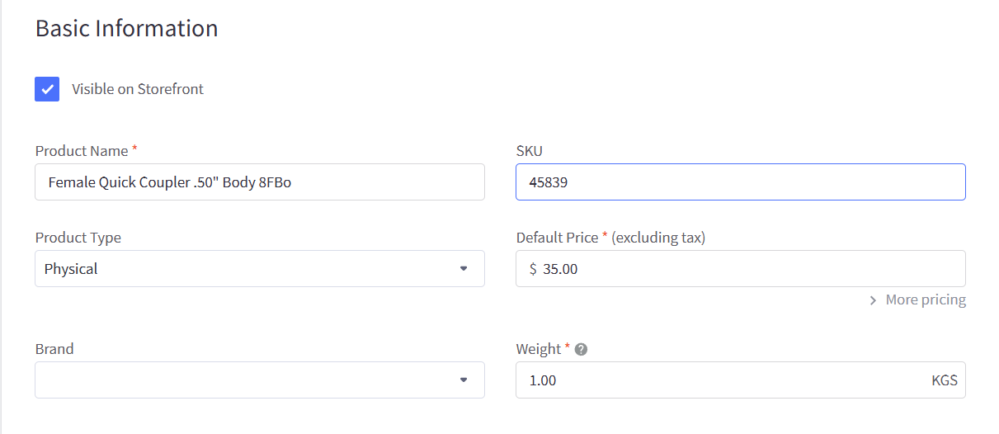
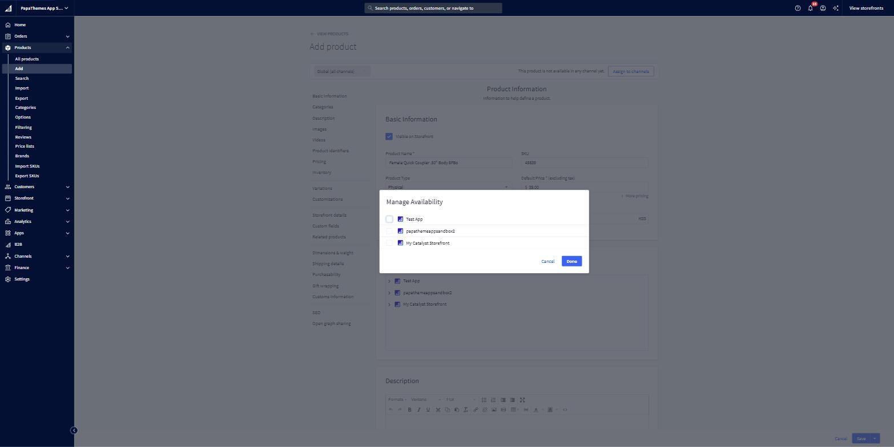
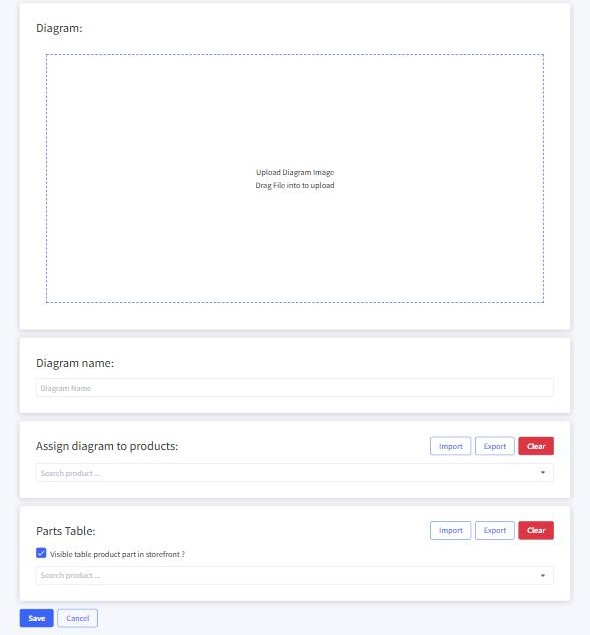
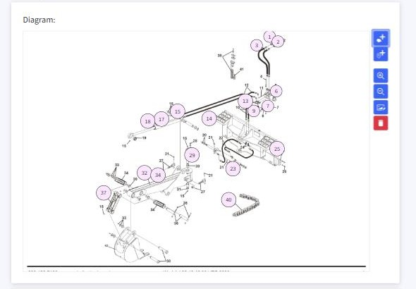
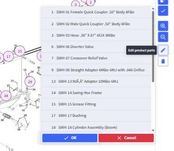
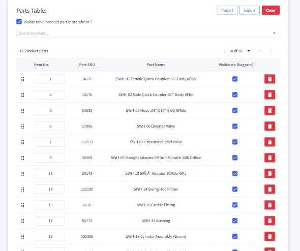
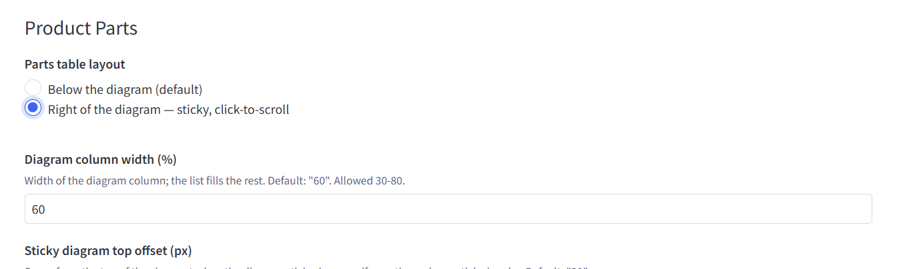

# Product Part Diagram — Bradco Swing Hoe Assembly

This is a worked example of a parts diagram on your store. Customers see the
exploded drawing on the left and a scrollable list of every part on the right.
They click a number on the drawing and the list jumps straight to that part,
ready to add to the cart.

The short video below walks through the whole thing with narration. Everything
after it is the same walkthrough in writing — with a screenshot for every step —
so you can follow along and repeat it on your other diagrams.

<video controls preload="metadata" width="100%" poster="../img/agriparts-diagram-result.jpg" style="border:1px solid #c7cfdb;border-radius:8px;">
  <source src="../img/agriparts-diagram-walkthrough.mp4" type="video/mp4">
  Your browser can't play this video — <a href="../img/agriparts-diagram-walkthrough.mp4">download it here</a>.
</video>

**Try the live example:**
[Bradco Swing Hoe Assembly](https://papathemes-app-sandbox.mybigcommerce.com/bradco-swing-hoe-assembly/){:target="_blank"}

---

## What you asked for

**A long parts list that runs past one page.** Every row in the list is a real
product, so there's no limit — add as many parts as the diagram needs. In this
layout the drawing stays pinned while the list scrolls on its own. This example
has 18 parts and already scrolls well past one screen.

**A sharp image when you zoom in.** The zoom button magnifies the diagram from
100% up to 300% right in the browser — it never loads a second, sharper file.
So how clean it looks at full zoom depends **entirely on the resolution of the
image you upload.** We exported this drawing from your PDF at 3060 × 2122 px, so
it stays crisp when enlarged. If a zoom ever looks blurry, the fix is always the
same: upload a higher-resolution image.

**Clicking a hotspot scrolls to the part.** Click any numbered dot on the
drawing and the list scrolls to that part and highlights the row — try it in the
live example above.

---

## Set it up, step by step

### Step 1 — Prepare your assets

You need **one high-resolution diagram image** and the **parts list** (item
number, part number, name). We took both straight from your *Swing Hoe
Assembly* PDF — the drawing from the diagram page and the parts from the tables
that follow.

> **Use the highest-resolution image you have.** Zoom sharpness depends only on
> the uploaded image — a small or screen-grabbed picture will look soft when
> enlarged.

### Step 2 — Create a product for each part

Every row in the parts list is a real BigCommerce product. In **Products → Add**,
create one per part: set the **SKU to the part number**, add a price and weight,
and make sure **Visible on Storefront** is checked.

Then click **Assign to channels** and tick your storefront channel(s):

> **This is the step that makes or breaks the list.** If a product is hidden, or
> on the wrong channel, the app quietly drops it from the parts list — no error
> message. It's the number-one reason a list shows up empty. See
> [Watch out for these](#watch-out-for-these) at the bottom.

### Step 3 — Create the assembly product

Create one more product — the page the diagram will live on. Here it's
*Bradco Swing Hoe Assembly*. Make it Visible and assign it to your channel, just
like the parts.

### Step 4 — Open the app and start a new diagram

Go to **Apps → Product Part Diagram**. Pick your storefront under **Channel
Sites**, then click **Add Diagram**.

On the new diagram screen, drop your image on the **Upload Diagram Image** box
(or click it to browse), and give the diagram a name.

### Step 5 — Place a numbered pin on each part

Use the **pinpoint tool** in the toolbar on the right of the image, then click
the drawing where each part sits. Each pin gets a number — set it to match the
item number on the drawing. Drag a pin any time to reposition it.

### Step 6 — Link each pin to its part

Click a pin to select it, then click the **pencil** in the toolbar. A list of
your parts opens — **tick the part(s) that pin points to**, and click **OK**.
This is what makes clicking the hotspot jump to the right row.

### Step 7 — Build the parts list

In the **Parts Table** panel, use **Search product…** to add each part, in the
order you want them listed. Set the **Item No.** for each row, and keep **Visible
on Diagram?** checked. Drag the handle on the left to reorder.

> **Tip — for long lists, import instead of typing.** The **Import** buttons on
> the *Assign diagram to products*, *Parts Table*, and *Manage Diagrams* screens
> let you load everything from a file. That's how all 18 hotspots in this example
> were added in one step — ask us and we'll prepare that file for you.

### Step 8 — Assign the diagram to your product page

In **Assign diagram to products**, search for and add your assembly product
(*Bradco Swing Hoe Assembly*). That's the page the diagram will show on. Click
**Save** at the bottom.

### Step 9 — Turn on the Messick-style two-column layout

Open **Settings** (top of the app) and, under **Product Parts → Parts table
layout**, choose **Right of the diagram — sticky, click-to-scroll**. That gives
you the drawing pinned on the left and the parts list scrolling on the right,
exactly like the Messick reference. You can tune the diagram column width and the
sticky offset here too. Click **Save**.

### Step 10 — Install the script and check it

Back on the app's main screen, click **Install the script on this site** (once
per storefront). Then open the assembly product on your storefront, click a few
hotspots, and zoom in to check the sharpness. That's the whole setup — repeat it
for any diagram.

---

## Watch out for these

> **Parts missing from the list?** A row only appears when its product is
> **Visible on the storefront** *and* on the **correct channel.** A hidden or
> wrong-channel product is dropped silently.

> **Blurry when zoomed?** Zoom quality depends 100% on the uploaded image.
> Re-upload a higher-resolution export.

> **Not showing two columns?** The "Right of the diagram" layout only kicks in on
> desktop when the diagram has both an image and at least one visible part.
> Otherwise it falls back to the parts-below layout.

---

## The example we built

| | |
|---|---|
| **Product page** | Bradco Swing Hoe Assembly |
| **Diagram** | 18 hotspots · "Right of the diagram" layout · zoom enabled |
| **Image** | 3060 × 2122 px, exported from the PDF |

**The 18 sample parts** — a spread across the drawing. The SKU is the
manufacturer part number.

| Item&nbsp;no. | Part&nbsp;no. (SKU) | Name |
|---|---|---|
| 1  | 14175  | Female Quick Coupler .50" Body 8FBo |
| 2  | 14176  | Male Quick Coupler .50" Body 8FBo |
| 3  | 38033  | Hose .38" X 87" 6FJX-8MBo |
| 6  | 17006  | Diverter Valve |
| 7  | 112137 | Crossover Relief Valve |
| 9  | 30369  | Straight Adapter 6MBo-6MJ with .046 Orifice |
| 13 | 30143  | 90° Adapter 10MBo-6MJ |
| 14 | 112130 | Swing Hoe Frame |
| 15 | 6616   | Grease Fitting |
| 17 | 85772  | Bushing |
| 18 | 105306 | Cylinder Assembly (Boom) |
| 23 | 112126 | Cylinder Assembly (Swing) |
| 25 | 62942  | Mounting Plate |
| 29 | 112135 | Pivot Pin 1.38" X 10.44" |
| 32 | 112120 | Boom |
| 34 | 105391 | Dipper Link |
| 37 | 105390 | Bucket Link |
| 40 | 88503  | Swing Chain - 13P |
