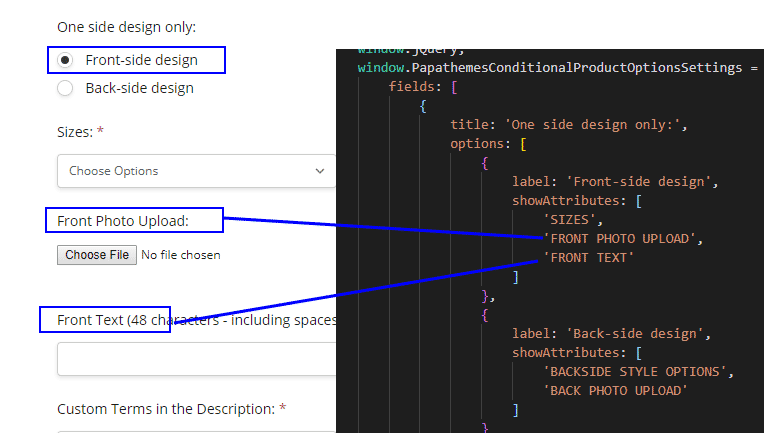

# Conditional Product Options

## Demo


## Install the script on your BigCommerce store

Go to **Storefront** > **Script Manager**, click **Create a Script**, choose:

- **Location on page** = `Footer`
- **Select pages where script will be added** = `All pages`
- **Script type** = `Script`

Enter the script below to **Scripts contents**: 

```html
<script>
    window.jQueryTheme = window.jQueryTheme || window.chiarajQuery || window.jQuery;
    window.PapathemesConditionalProductOptionsSettings = {
        fields: [
            {
                title: 'One side design only:',
                options: [
                    {
                        label: 'Front-side design',
                        showAttributes: [
                            'SIZES',
                            'FRONT PHOTO UPLOAD',
                            'FRONT TEXT'
                        ]
                    },
                    {
                        label: 'Back-side design',
                        showAttributes: [
                            'BACKSIDE STYLE OPTIONS',
                            'BACK PHOTO UPLOAD'
                        ]
                    }
                ]
            }
        ]
    };
</script>
<script src="//papathemes.com/content/conditionalproductoptionsaddon/conditional-product-options.public.js" async></script>
```

## Customize the dependent options

You can customize the option title and the radio labels by editing:
- `'One side design only:'`
- `'Front-side design'`
- `'Back-side design'`

Check the screenshot below:


### Configure the product options depending on the first choice



**Note:**
- The product option title entered in the configuration code snippet above must be in uppercase. 
- This string must be the same or appear at the beginning of your product option title.


### Configure the product options depending on the second choice


There is no limited number of choices and dependent product options. You can configure the configuration code to display more.

### Configure different dependent options for different products

Check below configuration example:

```js
window.PapathemesConditionalProductOptionsSettings = {
    fields: [
        {
            productIds: [1113, 1114],
            title: 'One side design only:',
            options: [
                {
                    label: 'Front-side design',
                    showAttributes: [
                        'FRONT TEXT'
                    ]
                },
                {
                    label: 'Back-side design',
                    showAttributes: [
                        'BACK TEXT'
                    ]
                }
            ]
        },
        {
            productIds: [1117],
            title: 'Front & Back design only:',
            options: [
                {
                    label: 'Front-side only design',
                    showAttributes: [
                        'SIZES',
                        'FRONT PHOTO UPLOAD',
                        'FRONT TEXT'
                    ]
                },
                {
                    label: 'Front & Back-side design',
                    showAttributes: [
                        'SIZES',
                        'FRONT PHOTO UPLOAD',
                        'FRONT TEXT',
                        'BACKSIDE STYLE OPTIONS',
                        'BACK PHOTO UPLOAD'
                    ]
                }
            ]
        }
    ]
};
```

- `productIds: [1113, 1114]` indicates that only products with ID = `1113` and `1114` will show `One side design only:` choices.
- `productIds: [1117]` indicates that only product with ID = `1117` will show `Front & Back design only` choices.

You can configure different dependent options for different products as well. Take a look at `showAttributes` parameters as showing in the example above.

#### Find Product ID

To find the product ID, edit the product in the admin page, look at your browser address bar, the product ID appears in the URL:


In this screenshot, the product ID is `174`.


##  An Alternative Solution

### Build the script for the alternative solution

```
npm run build --alternate
```

### Configure

```html
<script>
    window.jQueryTheme = window.jQueryTheme || window.jQuerySupermarket || window.jQuery;
    window.PapathemesConditionalProductOptionsSettings = {
        fields: [
            {
                name: 'Add Embroidered Logo',
                hide: [
                    'Logo Position on Garment',
                    'Logo Upload'
                ],
                values: [
                    {
                        value: 'Yes',
                        show: [
                            'Logo Position on Garment',
                            'Logo Upload'
                        ]
                    }
                ],
                productIds: []
            },
            {
                name: 'Embroidered Name',
                hide: [
                    'Name Position Garment',
                    'Enter Custom Text Here',
                    'Specify Text Colour'
                ],
                values: [
                    {
                        value: 'Yes',
                        show: [
                            'Name Position Garment',
                            'Enter Custom Text Here',
                            'Specify Text Colour'
                        ]
                    }
                ],
                productIds: [123, 456]
            }
        ]
    };
</script>
```


**Settings:**

- `fields`:
  - `name`: Is the option name (or label)
  - `hide`: Specify the dependent options to hide by default
  - `values`:
    - `value`: The option value text (or label) if selected then process the action below.
    - `show`: the dependent option to show if the coresponding value is matched.
  - `productIds`: Specify products to apply. If empty, apply for all products.


**Optional settings:**

```js
{
  productOptionsSelector: '[data-product-option-change]',
  optionLabelSelector: 'label:not([data-product-attribute-value])',
  formFieldSelector: '.form-field[data-product-attribute]',
  productIdSelector: 'input[name=product_id]',
}
```

