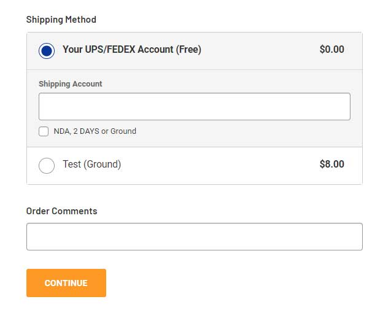

# Add Shipping Option: Your Customer's Shipping Account

Add a shipping option with your customer's shipping account on the checkout page.




## Install on your store (v2)

https://github.com/tvlgiao/bc-bigcommerce-api-app/tree/master/microapps/customer-shipping-account-v2

```html
<script>
    window.PapathemesCustomerShippingAccountV2Settings = {
        SHIPPING_METHOD: 'Flat rate',
        SHIPPING_ACCOUNT_FIELD: 'Shipping Account Number',
        EXTRA_FIELDS: ['Shipping Options'],
        DEBUG: false,
        checkoutId: '{{checkout.id}}'
    };
</script>
<script data-dev-src="http://localhost:5173/src/main.js" data-dev-type="module" src="https://d3r059eq9mm6jz.cloudfront.net/microapps/customer-shipping-account-v2/index.papathemes-app-sandbox.mybigcommerce.com.js" defer async></script>
```


## Install on your store (v1)

**New version:** https://github.com/tvlgiao/bc-bigcommerce-api-app/tree/master/microapps/customer-shipping-account


Create 2 custom fields in **Advanced Settings** > **Account Signup Form** > **Address Fields**:

1. `Shipping Account` (or any name you want), type = **Text Field**
2. `Shipping Options` (or any name you want), type = **Checkboxes**, values = `NDA, 2 DAYS or Ground` or example.

Find the custom fields' ID on the checkout page using Web Developer Tool of your browser (Ask our developer for help).

Add a new shipping option, You can use ShippingHQ to create a custom shipping option or ask our developer to create a new shipping option via BigCommerce API.

Create a new script in **Storefront** > **Script Manager**:

- **Location** = `Footer`
- **Display on Page** = `Checkout Page`
- **Script content**: Insert content from this file: https://github.com/tvlgiao/bc-supermarket-dev/blob/afead38f780ec1345ae8994fda3c354ac02bcef8/templates/components/harmonycr/customer-shipping-account.html

Update the variables below:

```js
var SHIPPING_ACCOUNT_FIELD_ID = 26;
var SHIPPING_OPTIONS_FIELD_ID = 28;
var SHIPPING_ACCOUNT_OPTION_LABEL = 'Your UPS/FEDEX Account';
```


