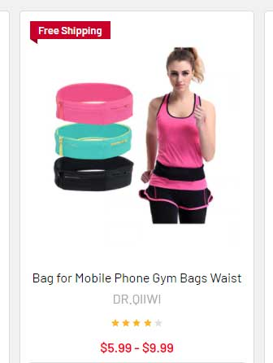

# Display Free Shipping Badges On Product Cards

## Install to your store



Create a script in Storefront > Script Manager:

- Location: Footer
- Display on Page: Store Pages
- Script Content:

```html
<script type="text/plain" id="papathemes_freeshippingbadge_custom_css">
    .card-figure { padding-top: 30px; }
    .sale-flag-side {
        left: 0;
        right: auto;
    }
    .sale-flag-side--freeShipping {
        background-image: url('data:image/png;base64,iVBORw0KGgoAAAANSUhEUgAAAAoAAACwCAMAAAABvQ+cAAAAh1BMVEX////9/f3n5+f29vby8vL39/fo6OiPtmhTj9Tp6elmqiLx9uzMACLu7u7v7+/5+fn6+vrs7Oz19fX7+/v+/v7r6+vw8PD8/Pz09PTq6urx8fHt7e2hFSx8m7+5UWJPeKnm5uZlmjDv8/eZABlXkR3H2rTAz+Ddq7PcqLG9zd/G2rP36uw/bKF169q0AAAAoUlEQVR4XuXRRQ4DMRiD0T8ZKDMzc+9/vo5sKd7MBZJ69aRvaeuG/Quf2wvnzT57srRqD4RWJQaSYQUgzCxsJG7EvjgX12IuLsWxmImFOBCH4kRciK6WU2uGpcfX4ct5s/OOxLF3BLyJQDLgWIaoj83DYmZWHjlv5nokLiwQ8BsCyYALGaK+sH7tsPT4Pl05b9ZpkLj7hoCPEUgG3M2Q3t0/Lh8w5rk+07gAAAAASUVORK5CYII=') !important;
        background-color: transparent !important;
        background-repeat: no-repeat !important;
        background-position: top left !important;
        padding: 0;
        height: 30px;
    }
    .sale-flag-side--freeShipping span {
        background-color: #c02;
        color: #fff;
        display: inline-block;
        height: 22px;
        line-height: 22px;
        padding: 0 10px;
    }
</script>
<script>
    (function() {
        var FREESHIPPING_BADGE = 'Killer Deals';
        // var API_URL = 'http://localhost:5000/api/supermarket-yellow-demo.mybigcommerce.com';
        var API_URL = 'https://mgdrbagut7.execute-api.us-east-1.amazonaws.com/latest/api/supermarket-yellow-demo.mybigcommerce.com';

        function debounce(n,t,u){var e;return function(){var i=this,o=arguments,a=u&&!e;clearTimeout(e),e=setTimeout(function(){e=null,u||n.apply(i,o)},t),a&&n.apply(i,o)}}

        function css() {
            var style = document.createElement('style');
            style.innerHTML = document.getElementById('papathemes_freeshippingbadge_custom_css').innerHTML;
            document.head.appendChild(style);
        }

        function main() {
            var $ = window.jQuerySupermarket || window.jQuery;

            function observe() {
                var productIds = [];
                var $cardById = {};
                $('.card').not('._free-shipping-badge-loaded').each(function(i, el) {
                    var $el = $(el);
                    var id = $el.find('[data-product-id]').first().data('productId');
                    $el.addClass('_free-shipping-badge-loaded');
                    if (id) {
                        productIds.push(id);
                        $cardById[id] = $el;
                    }
                });
                if (productIds.length > 0) {
                    $.get(`${API_URL}/products/shipping-cost?ids=${productIds.join(',')}`, function(resp) {
                        resp.map(function(product) {
                            if (product.is_free_shipping) {
                                var $el = $cardById[product.id];
                                if ($el && $el.find('.sale-flag-side--freeShipping').length === 0) {
                                    $el.find('.card-figure').prepend(
                                        '<div class="sale-flag-side sale-flag-side--freeShipping"><span class="sale-text">'
                                        .concat(FREESHIPPING_BADGE)
                                        .concat('</span></div>')
                                    );
                                }
                            }
                        })
                    });
                }
            }

            var mo = new MutationObserver(debounce(observe, 300));
            mo.observe(document.body, { childList: true, subtree: true });
            observe();
        }

        css();
        if (!window.jQuerySupermarket && !window.jQuery) {
            var script = document.createElement('script');
            script.src = 'https://code.jquery.com/jquery-3.5.1.js';
            script.integrity = 'sha256-QWo7LDvxbWT2tbbQ97B53yJnYU3WhH/C8ycbRAkjPDc=';
            script.crossOrigin = 'anonymous';
            script.onload = main;
            document.head.appendChild(script);
        } else {
            main();
        }
    })();
</script>
```

Edit the variables to change the badge label and the API URL to match your store:

```js
var FREESHIPPING_BADGE = 'Killer Deals';
var API_URL = 'https://mgdrbagut7.execute-api.us-east-1.amazonaws.com/latest/api/supermarket-yellow-demo.mybigcommerce.com';
```


## Developer's Resource

- https://github.com/tvlgiao/bc-productshippingcost-app
- https://github.com/tvlgiao/bc-supermarket-dev/tree/addons-dev

