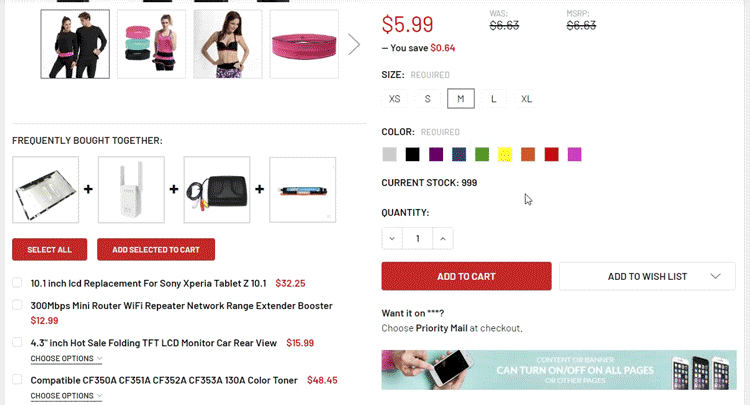

# Products Frequently Bought Together



## Install on your BigCommerce theme

1. Extract [THEME_MOD.zip](https://papathemes.com/content/alsoboughtaddon/THEME_MOD.zip) and copy all files in `templates/components/papathemes/also-bought/` to your theme with the corresponding path `templates/components/papathemes/also-bought/`.


2. Edit file `assets/js/app.js` of your theme, find the line:

```js
const customClasses = {};
```

Insert the code below under it:

```js
// PapaThemes AlsoBought MOD
if (!window.jQueryTheme) {
    window.jQueryTheme = $;
}
```


3. Edit file `assets/js/theme/common/product-details.js`, find the line:

```js
this.previewModal = modalFactory('#previewModal')[0];
```

Insert the code below under it:

```js
// PapaThemes AlsoBought MOD
$('body').trigger('product-details-init', [this]);
$('body').one('load.alsobought', (event, callback) => callback(event, this));
```


4. Edit file `lang/en.json`, At the end of file, before the last `}`, insert the code below:

```json
    ,
    "also_bought": {
        "heading": "Frequently bought together:",
        "add_all": "Select all",
        "add_selected_to_cart": "Add selected to cart"
    }
```


Add the code below to **Storefront** > **Script Manager**, **Location** = `Footer`, **Pages** = `All Storefront Pages`:

```html
<script>window.jQueryAlsoBought = window.jQueryTheme || window.jQuery;</script>
<script src="//papathemes.com/content/alsoboughtaddon/alsobought.YOURDOMAIN.js" async></script>
```

**Note:** replace `YOURDOMAIN` by your own domain, example:

```html
<script>window.jQueryAlsoBought = window.jQueryTheme || window.jQuery;</script>
<script src="//papathemes.com/content/alsoboughtaddon/alsobought.rcsuperstore.com.js" async></script>

```


## Assign frequently bought products to a product

Edit your product, add some custom field with name `__alsobought` and value is the frequently product ID. You can add many custom field `__alsobought` as you want.

Example:

* `__alsobought` : `389`
* `__alsobought` : `388`
* `__alsobought` : `390`


## Advanced configuration

```html
<script>
    window.jQueryAlsoBought = window.jQueryTheme || window.jQuery;
    // Optional configuration to display Also Bought at different position:
    window.AlsoBoughtOptions = {
        getScopeWithoutAlsoBought: function($scope) {
            return $scope.children().not('[data-also-bought]');
        },
        renderAlsoBought: function(alsoBought) {
            alsoBought.$alsoBoughtEl.appendTo(alsoBought.parentProductDetails.$scope);
        }
    };
</script>
<script src="//papathemes.com/content/alsoboughtaddon/alsobought.YOURDOMAIN.js" async></script>
```

- `getScopeWithoutAlsoBought`: Callback function to retrieve the HTML element of the product view scope excluding the element contains the products frequently bought together.
- `renderAlsoBought`: callback function to print out the product frequently bought together.


## Make products frequently bought together add to cart independently from the main product

```html
<script>
    window.jQueryAlsoBought = window.jQueryTheme || window.jQuery;
    window.AlsoBoughtOptions = {
        independent: true
    };
</script>
<script src="//papathemes.com/content/alsoboughtaddon/alsobought.YOURDOMAIN.js" async></script>
```

Set `independent: true` in the script option.
