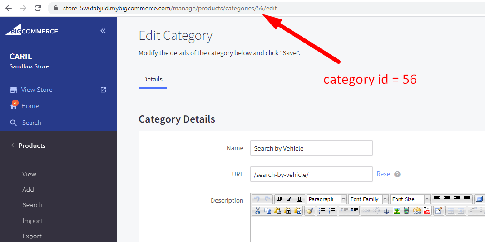
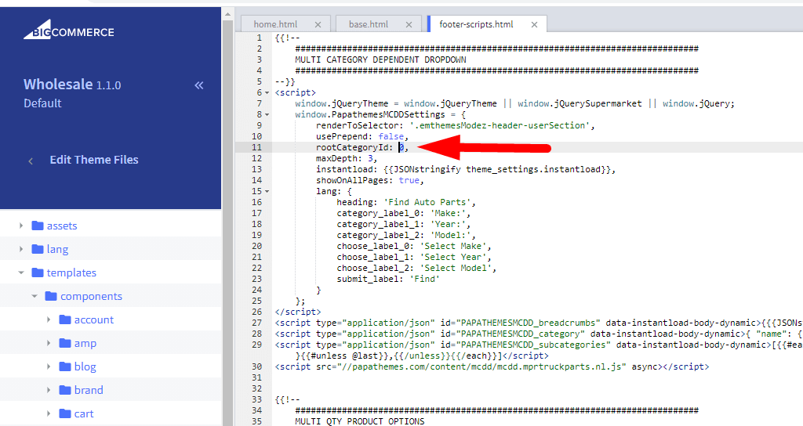

# Multiple Category Dependent Dropdowns

**This feature helps customers find products more easily by displaying interconnected category dropdown menus.**

## 🎯 What does this feature do?

Instead of customers having to manually browse through categories one by one, this feature will:

- Display interconnected dropdown menus
- When a customer selects a category, the next dropdown automatically updates with relevant options
- Help customers find the right products quickly and efficiently

## 📱 Display Layouts

**Horizontal layout (suitable for top of page display):**


**Vertical layout (suitable for sidebar display):**


**Vertical layout - 5 category levels:**


## 🛠️ How to Install on Your BigCommerce Store

### 📐 Method 1: Horizontal Layout

**Step 1:** Access your BigCommerce admin panel

**Step 2:** Go to **Storefront** > **Script Manager**, then click **Create a Script**

**Step 3:** Configure the following settings:

- **Location on page** = `Footer`
- **Select pages where script will be added** = `All pages`
- **Script type** = `Script`

**Step 4:** Copy and paste the following code into **Scripts contents**:

```html
<script>
    window.jQueryTheme = window.jQueryTheme || window.jQuerySupermarket || window.jQuery;
    window.PapathemesMCDDSettings = {
        renderToSelector: 'body > .body',
        usePrepend: true,
        rootCategoryId: 0,
        maxDepth: 3,
        showOnAllPages: true,
        lang: {
            heading: 'Find Auto Parts',
            category_label_0: 'Make:',
            category_label_1: 'Year:',
            category_label_2: 'Model:',
            choose_label_0: 'Select Make',
            choose_label_1: 'Select Year',
            choose_label_2: 'Select Model',
            submit_label: 'Find'
        }
    };
</script>
<script type="application/json" id="PAPATHEMESMCDD_breadcrumbs" data-instantload-body-dynamic>{{{JSONstringify breadcrumbs}}}</script>
<script type="application/json" id="PAPATHEMESMCDD_category" data-instantload-body-dynamic>{ "name": {{{JSONstringify category.name}}}, "id": {{{JSONstringify category.id}}}, "url": {{{JSONstringify category.url}}} }</script>
<script type="application/json" id="PAPATHEMESMCDD_subcategories" data-instantload-body-dynamic>[{{#each category.subcategories}}{ "name": {{{JSONstringify name}}}, "id": {{{JSONstringify id}}}, "url": {{{JSONstringify url}}} }{{#unless @last}},{{/unless}}{{/each}}]</script>
<script src="//papathemes.com/content/mcdd/mcdd.YOURDOMAIN.js" async></script>
```

**Step 5:** Customize the following settings:

- **Replace `YOURDOMAIN`**: Change `YOURDOMAIN` to your domain name (example: `mydomain.com`)
- **Display position**: You can change `'body > .body'` to another location where you want to display the form
- **Number of category levels**: Change the number `3` in `maxDepth: 3` to increase/decrease the number of dropdowns
- **Display on which pages**: `showOnAllPages: true` means display on all pages
- **Customize text**: Modify the text in the `lang` section as desired:
  - `heading`: Form title
  - `category_label_0, 1, 2`: Labels for each dropdown
  - `choose_label_0, 1, 2`: Default text in dropdowns
  - `submit_label`: Search button text


### 📐 Method 2: Vertical Layout

**Steps 1-3:** Follow the same steps as Method 1 above

**Step 4:** Copy and paste the following code into **Scripts contents**:

```html
<script>
    window.jQueryTheme = window.jQueryTheme || window.jQuerySupermarket || window.jQuery;
    window.PapathemesMCDDSettings = {
        renderToSelector: '.page-sidebar',
        usePrepend: true,
        rootCategoryId: 0,
        maxDepth: 5,
        showOnAllPages: true,
        verticalLayout: true,
        lang: {
            heading: 'Find Auto Parts',
            category_label_0: 'Make:',
            category_label_1: 'Year:',
            category_label_2: 'Model:',
            choose_label_0: 'Select Make',
            choose_label_1: 'Select Year',
            choose_label_2: 'Select Model',
            submit_label: 'Find'
        }
    };
</script>
<script type="application/json" id="PAPATHEMESMCDD_breadcrumbs" data-instantload-body-dynamic>{{{JSONstringify breadcrumbs}}}</script>
<script type="application/json" id="PAPATHEMESMCDD_category" data-instantload-body-dynamic>{ "name": {{{JSONstringify category.name}}}, "id": {{{JSONstringify category.id}}}, "url": {{{JSONstringify category.url}}} }</script>
<script type="application/json" id="PAPATHEMESMCDD_subcategories" data-instantload-body-dynamic>[{{#each category.subcategories}}{ "name": {{{JSONstringify name}}}, "id": {{{JSONstringify id}}}, "url": {{{JSONstringify url}}} }{{#unless @last}},{{/unless}}{{/each}}]</script>
<script src="//papathemes.com/content/mcdd/mcdd.YOURDOMAIN.js" async></script>
```

**Step 5:** Customize the following settings:

- **Replace `YOURDOMAIN`**: Change `YOURDOMAIN` to your domain name
- **Display position**: You can change `'.page-sidebar'` to another location
- **Number of levels**: You can change `maxDepth: 5` to increase/decrease the number of dropdowns
- **Vertical layout**: `verticalLayout: true` displays the form vertically
- **Customize text**: Modify the text in the `lang` section as desired

### 🎨 Method 3: Installation for Supermarket Theme

**Note:** Only applies to stores using the Supermarket theme

**Steps 1-3:** Follow the same steps as the methods above

**Step 4:** Copy and paste the following code:

```html
<script>
    window.PapathemesMCDDSettings = {
        renderToSelector: 'body > .body',
        usePrepend: true,
        rootCategoryId: 0,
        maxDepth: 3,
        instantload: {{JSONstringify theme_settings.instantload}},
        lang: {
            heading: 'Find Auto Parts',
            category_label_0: 'Make:',
            category_label_1: 'Year:',
            category_label_2: 'Model:',
            choose_label_0: 'Select Make',
            choose_label_1: 'Select Year',
            choose_label_2: 'Select Model',
            submit_label: 'Find'
        }
    };
</script>
<script type="application/json" id="PAPATHEMESMCDD_breadcrumbs" data-instantload-body-dynamic>{{{JSONstringify breadcrumbs}}}</script>
<script type="application/json" id="PAPATHEMESMCDD_category" data-instantload-body-dynamic>{ "name": {{{JSONstringify category.name}}}, "id": {{{JSONstringify category.id}}}, "url": {{{JSONstringify category.url}}} }</script>
<script type="application/json" id="PAPATHEMESMCDD_subcategories" data-instantload-body-dynamic>[{{#each category.subcategories}}{ "name": {{{JSONstringify name}}}, "id": {{{JSONstringify id}}}, "url": {{{JSONstringify url}}} }{{#unless @last}},{{/unless}}{{/each}}]</script>
<script src="//papathemes.com/content/mcdd/mcdd.supermarket.js" async></script>
```

**Step 5:** Customize the following settings:

- **Display position**: You can change `'body > .body'` to another location where you want to display the form
- **Number of levels**: Change `maxDepth: 3` to adjust the number of dropdowns
- **Customize text**: Edit the text in the `lang` section

## 📝 Category Setup Guide

**For the feature to work properly, you need to set up categories in a hierarchical order:**

**Step 1: Create Category Structure**

Create categories in order from general to specific. Example for an auto parts store:


**Step 2: Assign Products**

Assign products to the appropriate final-level categories (the most specific subcategories).

**Step 3: Find Root Category ID**

- Go to your store's category management section
- Select the root category (highest level category) that you want as the starting point
- Find the category ID in the browser address bar:



**Step 4: Update Category ID in Code**

Replace the number `0` in `rootCategoryId: 0` with the category ID you just found:



## ✅ Expected Results

After completing the above steps, customers will see:

- The search form appears at the selected location
- Category dropdowns are interconnected
- When selecting a category, the next dropdown automatically updates
- The "Find" button will take customers to the appropriate category or product page

## 🔧 Important Notes

- Ensure the category structure is set up in proper hierarchical order
- All products must be assigned to final-level categories
- Text can be customized according to your store's language and industry
- If you encounter issues, check the category ID and hierarchical structure again
