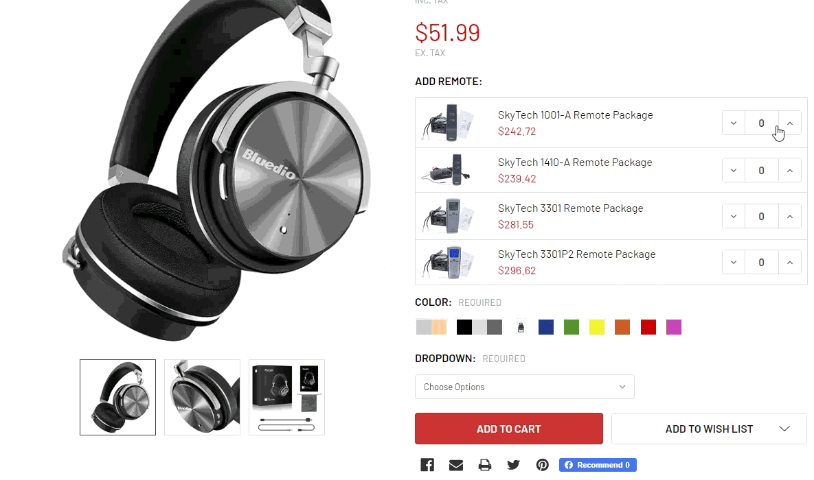
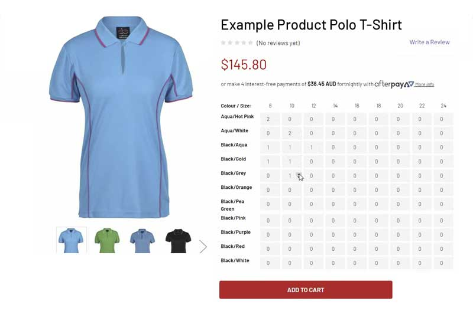

# Multiple Quantity Product Options

This extension will replace BigCommerce's default product options or products pick list to a child products list with ability to select quantity and add products to cart at the same time. Similar the grouped products feature in Magento or WooCommerce.



## Install on your BigCommerce store


Go to **Storefront** > **Script Manager**, click **Create a Script**, choose:

- **Location on page** = `Footer`
- **Select pages where script will be added** = `All pages`
- **Script type** = `Script`

Enter the script below to **Scripts contents**: 

```html
<script>
    window.jQueryTheme = window.jQueryTheme || window.jQuerySupermarket || window.jQuery;
    window.PapathemesMultiQtyProductOptionsSettings = {
        fields: [
            {
                name: 'Add Remote',
                productIds: []
            }
        ],
        cartId: '{{cart_id}}'
    };
</script>
<script src="//papathemes.com/content/multiqtyproductoptions/multi-qty-product-options.YOURDOMAIN.js" async></script>
```

Replace `YOURDOMAIN` by your domain name, for example: `mystore.com`.


**Configuration:**

- `fields`:
  + `name`: is your product option name or label.
  + `productIds`: array of product IDs to enable MQPO for this product option. Please `[]` to apply for all products.
- `cartId`: Is your cart object ID, leave it unchanged as above configuration.


**Other optional configuration:**

- `productOptionsSelector = '[data-product-option-change]'`: Product option selector.
- `optionLabelSelector = 'label'`: Product option label selector.
- `formFieldSelector = '.form-field[data-product-attribute]'`: Form field selector.
- `quantityFormFieldSelector = '.form-field--increments'`: Quantity form field selector.
- `productIdSelector = 'input[name=product_id]'`: Product ID input selector.
- `productViewSelector = '.productView'`: productView element selector.
- `productTitleSelector = '.productView-title'`: product title selector.
- `priceWithTaxSelector = '[data-product-price-with-tax]'`: price with tax selector.
- `priceWithoutTaxSelector = '[data-product-price-without-tax]'`: price without tax selector.
- `productOptionsListSelector = '.productOptions-list'`: products pick list selector.
- `addedToCartMsgTitle = 'Added to your cart!'`: Add to Cart popup title.
- `cartContentFile = 'cart/content'`: Cart content template file. Only need for stencil-utils 1.x.
- `hideMainPrice = false`: Hide the main product price.
- `hideMainQty = false`: Hide the main product quantity input box.
- `useThemeAddToCartForMainProduct = false`: Use the theme's add to cart function when adding the main product to cart.

```js
productListTemplate = `
    <div class="mqpo-productsList">
        <%#list%>
        <div class="_item" data-mqpo-attribute-item>
            <%#imgTag%><div class="_img" data-img><%&.%></div><%/imgTag%>
            <div class="_title" data-name><%name%></div>
            <div class="_props">
                <span class="_sku-label" data-mqpo-sku-label style="display:none">SKU:</span> <span class="_sku-value" data-mqpo-sku style="display:none"></span>
                <span class="price price--withTax" data-mqpo-price-with-tax style="display:none"></span> <span class="_price-label" data-mqpo-price-with-tax-label style="display:none">(Incl. <span data-mqpo-tax-label></span>)</span>
                <span class="price price--withoutTax" data-mqpo-price-without-tax style="display:none"></span> <span class="_price-label" data-mqpo-price-without-tax-label style="display:none">(Excl. <span data-mqpo-tax-label></span>)</span>
            </div>
            <div class="_qty">
                <div class="form-increment" data-mqpo-quantity-change>
                    <button class="button button--icon" data-action="dec">
                        <span class="is-srOnly">Decrease Quantity:</span>
                        <i class="icon" aria-hidden="true"><svg><use xlink:href="#icon-keyboard-arrow-down"></use></svg></i>
                    </button>
                    <input class="form-input form-input--incrementTotal" id="qty_<%id%>" data-mqpo-attribute-id="<%attrId%>" data-mqpo-attribute-value="<%attrVal%>" type="tel" value="0" data-quantity-min="<%min%>" data-quantity-max="<%max%>" min="0" pattern="[0-9]*" aria-live="polite">
                    <button class="button button--icon" data-action="inc">
                        <span class="is-srOnly">Increase Quantity:</span>
                        <i class="icon" aria-hidden="true"><svg><use xlink:href="#icon-keyboard-arrow-up"></use></svg></i>
                    </button>
                </div>
            </div>
        </div>
        <%/list%>
    </div>`,
```

Products List template.

```js
productTableTemplate = `
    <div class="mqpo-productsTable">
        <div class="_row">
            <%#columnNames%>
                <div class="_col"><%&.%></div>
            <%/columnNames%>
        </div>
        <%#rows%>
            <div class="_row">
                <div class="_col"><span class="_name"><%&name%></span></div>
                <%#columns%>
                    <div class="_col" data-mqpo-attribute-item>
                        <span style="display:none" data-name><%fullName%></span>
                        <span class="_name"><%&name%></span>
                        <span class="price price--withTax" data-mqpo-price-with-tax style="display:none"></span> <span class="_price-label" data-mqpo-price-with-tax-label style="display:none">(Incl. <span data-mqpo-tax-label></span>)</span>
                        <span class="price price--withoutTax" data-mqpo-price-without-tax style="display:none"></span> <span class="_price-label" data-mqpo-price-without-tax-label style="display:none">(Excl. <span data-mqpo-tax-label></span>)</span>
                        <div class="form-increment" data-mqpo-quantity-change>
                            <button class="button button--icon" data-action="dec">
                                <span class="is-srOnly">Decrease Quantity:</span>
                                <i class="icon" aria-hidden="true"><svg><use xlink:href="#icon-keyboard-arrow-down"></use></svg></i>
                            </button>
                            <input class="form-input form-input--incrementTotal" id="qty_<%id%>" data-mqpo-attribute-id="<%attrId%>" data-mqpo-attribute-value="<%attrVal%>" type="number" value="" data-quantity-min="<%min%>" data-quantity-max="<%max%>" min="0" pattern="[0-9]*" aria-live="polite">
                            <button class="button button--icon" data-action="inc">
                                <span class="is-srOnly">Increase Quantity:</span>
                                <i class="icon" aria-hidden="true"><svg><use xlink:href="#icon-keyboard-arrow-up"></use></svg></i>
                            </button>
                        </div>
                    </div>
                <%/columns%>
            </div>
        <%/rows%>
    </div>
`,
```

Product Table template.

```js
addedToCartMsgTemplate = `
    <div class="mqpo-addedToCartMsg-content">
        <div class="_msg"><%msg%></div>
        <ul class="_list">
            <%#list%>
                <li class="_item">
                    <%#imgTag%><div class="_img"><%&.%></div><%/imgTag%>
                    <div class="_title"><%&name%></div>
                    <div class="_qty"><%qty%></div>
                </li>
            <%/list%>
        </ul>
        <div class="_actions">
            <a class="button button--primary" href="/checkout.php">Checkout Now</a>
            <a class="button" href="/cart.php">View your Cart</a>
        </div>
    </div>
`,
```

Add to Cart sucessful message template.


**Example script for shoppartsland.com:**

```html
<script>
    window.jQueryTheme = window.jQueryTheme || window.jQuerySupermarket || window.jQuery;
    window.PapathemesMultiQtyProductOptionsSettings = {
        fields: [
            {
                name: 'Color',
                productIds: []
            }
        ],
        cartId: '{{cart_id}}'
    };
    (function() {
        var css = document.createElement('style');
        css.innerHTML = '.mqpo-productsList { font-size: 14px }';
        document.head.appendChild(css);
    })();
</script>
<script src="//papathemes.com/content/multiqtyproductoptions/multi-qty-product-options.shoppartsland.com.js" async></script>
```

### Vertical style


```html
<style>
html .mqpo-productsList {
    display: flex;
    flex-wrap: wrap;
    border: 0;
    margin: 0 -.25rem;
}
html .mqpo-productsList._set-rectangle ._item {
    display: block;
    width: 5rem;
}
html .mqpo-productsList ._item + ._item {
    border-top: 0;
}
html .mqpo-productsList ._item ._title {
    text-align: center;
    padding: .25rem;
    border: 1px solid #ddd;
    margin-bottom: 2px;
}
html .mqpo-productsList ._item ._props {
    display: none;
}
html .mqpo-productsList ._item ._qty {
    display: block;
}
html .mqpo-productsList ._item ._qty .form-increment {
    display: block;
    border: 0;
}
html .mqpo-productsList ._item ._qty .form-increment .button {
    display: none;
}
html .mqpo-productsList ._item ._qty .form-increment .form-input {
    display: block;
    width: 100%;
    height: 2rem;
    padding: .25rem;
    text-align: center;
    border: 0;
    border-radius: 0;
    background-color: #ddd;
    font-weight: 700;
}
html .mqpo-productsList ._item ._qty .form-increment .form-input:hover,
html .mqpo-productsList ._item ._qty .form-increment .form-input:focus {
    background-color: #eee;
}
</style>
```

## Configuration for product options table



```html
<script>
    window.jQueryTheme = window.jQueryTheme || window.jQuerySupermarket || window.jQuery;
    window.PapathemesMultiQtyProductOptionsSettings = {
        fields: [
            {
                name: ['Colour', 'Size'],
                productIds: []
            }
        ],
        cartId: '{{cart_id}}'
    };
</script>
<script src="//papathemes.com/content/multiqtyproductoptions/multi-qty-product-options.YOURDOMAIN.js" async></script>
```

- `name: ['Colour', 'Size']`: is an array of titles of 2 product options.
- `productIds: []`: is an array of the product IDs which enable this feature.


### Alternative style CSS


```css
html .mqpo-productsTable {
    display: block;
    max-height: 300px;
    overflow: auto;
    margin-bottom: 1.5rem
}

@media (min-width: 801px) {
    html .mqpo-productsTable ._row ._col {
        width:40px
    }

    html .mqpo-productsTable ._row ._col .form-increment .form-input[type=number] {
        width: 35px
    }

    html .mqpo-productsTable ._row ._col:first-child {
        width: 120px
    }

    html .mqpo-productsTable ._row ._col:first-child ._name {
        text-align: left
    }

    html .mqpo-productsTable ._row ._col:first-child ._name>* {
        vertical-align: middle
    }

    html .mqpo-productsTable ._row ._col:first-child ._name ._ow_label {
        margin-left: .375rem
    }

    html .mqpo-productsTable ._row ._col ._name {
        display: block;
        text-align: center
    }

    html .mqpo-productsTable ._row:first-child {
        display: none
    }

    html .mqpo-productsTable ._row+._row {
        border-bottom: 1px solid #e5e5e5;
        padding-bottom: .8125rem
    }

    html .mqpo-productsTable ._row+._row ._col:first-child {
        display: -ms-flexbox;
        display: flex;
        -ms-flex-align: end;
        align-items: flex-end;
        padding-bottom: .375rem
    }
}

html .mqpo-productsTable::-webkit-scrollbar {
    width: 10px;
    height: 10px
}

html .mqpo-productsTable::-webkit-scrollbar-track {
    -webkit-box-shadow: inset 0 0 10px rgba(0,0,0,.3);
    border-radius: 10px
}

html .mqpo-productsTable::-webkit-scrollbar-thumb {
    border-radius: 10px;
    background: rgba(255,0,0,.8);
    -webkit-box-shadow: inset 0 0 10px rgba(0,0,0,.5)
}

html .mqpo-productsTable::-webkit-scrollbar-thumb:window-inactive {
    background: rgba(255,0,0,.4)
}
```

## Display bulk pricing with unit price

```html
<script>
    window.PapathemesMultiQtyProductOptionsSettings = {
        ...
        bulkPriceConfig: {
            addBulkPricingElementFunc: function($bulkPricing, $productView) {
                $productView.find('.productView-priceShareWrapper').after($bulkPricing);
            }
        },
        graphQLToken: '{{settings.storefront_api.token}}',
        ...
    };
</script>
<script src="//papathemes.com/content/multiqtyproductoptions/addon.bulk-price.YOURDOMAIN.js" async defer></script>
```

## Check product minimum and maximum quantity on cart page

```html
<script src="//papathemes.com/content/multiqtyproductoptions/addon.cart-qty-check.YOURDOMAIN.js" async defer></script>
```


## Install for Supermarket theme

Add below options:

```js
priceWithTaxSelector: '[data-also-bought-parent-scope] [data-product-price-with-tax]',
priceWithoutTaxSelector: '[data-also-bought-parent-scope] [data-product-price-without-tax]',
```

## Version 2 (Beta):

### Product Options Bulk Order

```html
<script>
    window.PapaThemesProductOptionsBulkOrderSettings = {
        storeHash: '{{settings.store_hash}}',
        rules: [
            {
                productIds: [],
                options: [
                    'Colour',
                    'Color'
                ]
            }
        ]
    };
</script>
<script src="https://d3r059eq9mm6jz.cloudfront.net/microapps/product-options-bulk-order/main.YOURDOMAIN.js" async defer></script>
```

### Product Variants Bulk Order

Similar to **product-options-bulk-order** but display all product variants.

Git: https://github.com/tvlgiao/bc-bigcommerce-api-app/microapps/product-variants-bulk-order

