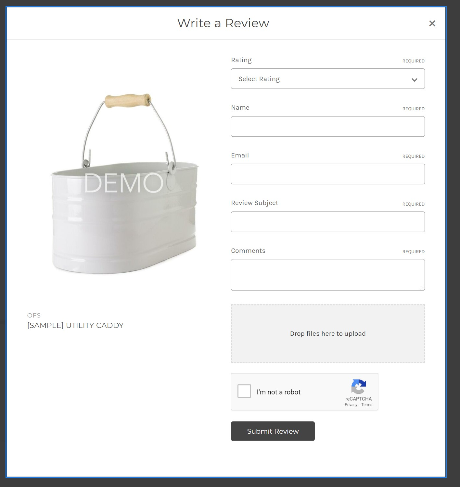

# Product Review Images


## Install on your BigCommerce Store

Go to **Storefront** > **Script Manager**, click **Create a Script**, choose:

- **Location on page** = `Footer`
- **Select pages where script will be added** = `Store Pages`
- **Script type** = `Script`

Enter the script below to **Scripts contents**: 


```html
<script>
    window.PapathemesReviewFileUploadSettings = {
        graphQLToken: '{{settings.storefront_api.token}}',
        storeHash: '{{settings.store_hash}}'
    };
    (function() {
        var link = document.createElement('link');
        link.href = 'https://d1zh3k10d52vcg.cloudfront.net/scripts/0.1.2/reviewfileupload.css';
        link.rel = 'stylesheet';
        document.head.appendChild(link);
    })();
</script>
<script src="https://d1zh3k10d52vcg.cloudfront.net/scripts/0.1.2/reviewfileupload.js" async defer></script>
```

## Register your API Token Acess

### Create the API Access Key

Login to your BC admin panel with **store owner account**, go to Advanced Settings > API Accounts > Click **Create V2/V3 API Token** from **Create API Account** dropdown button.

Copy and store the **API Path** (example: https://api.bigcommerce.com/stores/vsupzbml60/v3/). In **OAuth Scopes**, choose **Products** = `Modify`. Then click **Save** button.

Copy and store **API Access Token** key.

### Access App Dashboard

Open this link: http://d1zh3k10d52vcg.cloudfront.net/app.html

Enter:

- Email: is your store owner's email address.
- Access Token: enter the **API Access Token** generated from the previous step.
- Store Hash: Enter your store hash code that appears in the **API Path**. For example: `vsupzbml60`.

Then click **Sign In** button.

When your customers submit reviews with photos, it will appear here. Note that the old reviews won't display.


## Customer Reviews Submission Form

After installed the script and registered your API Token Access key,  The image upload field automatically appears on the **Write a Review** form.



## Product Reviews

Review images automatically display on product reviews.


