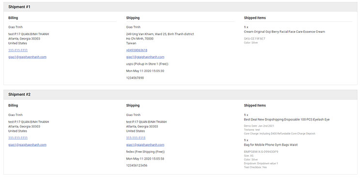

# Shipment Details

This app allows to display detailed shipments include shipped products, billing address, shipping address and tracking details on customer's order page.




## Install on your BigCommerce store

In your BigCommerce store admin page, go to **Advanced Settings** > **Web Analytics** > Tick on **Site Verification Tags**. Then click **Save** button. Open **Site Verification Tags**, enter the script below to **Site Verification Header Scripts**:

```html
<script>
    window.PAPATHEMES_SHIPMENT_DETAILS_SETTINGS = {
        storeDomain: 'supermarket-yellow-demo.mybigcommerce.com',
        customerId: '{{customer.id}}',
        currencySetting: {{{JSONstringify settings.money}}},
    };
</script>
<script src="{{cdn 'assets/dist/addon.shipment-details.js'}}" defer></script>
```

Replace `supermarket-yellow-demo.mybigcommerce.com` by your store domain.


### Create API account

Log in with your store owner account. Go to **Advanced Settings** > **API Settings**, click **Create API Account** and choose **Create V2/V3 API Token**.

Choose these permission:

- **Customers**: Read-Only
- **Information & Settings**: Read-Only
- **Orders**: Read-Only
- **Products**: Read-Only
- **Order Transactions**: Read-Only

Then click **Save** button.

**Send us the credentials TXT file.**


