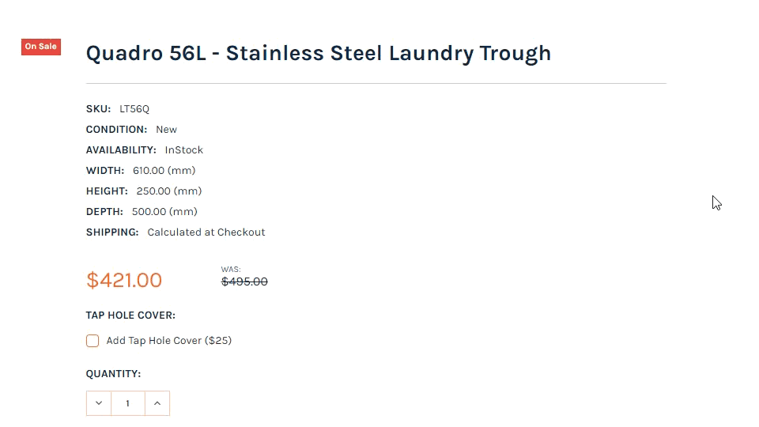
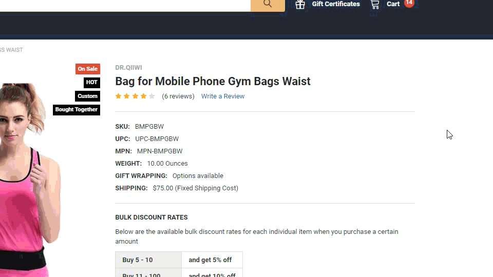
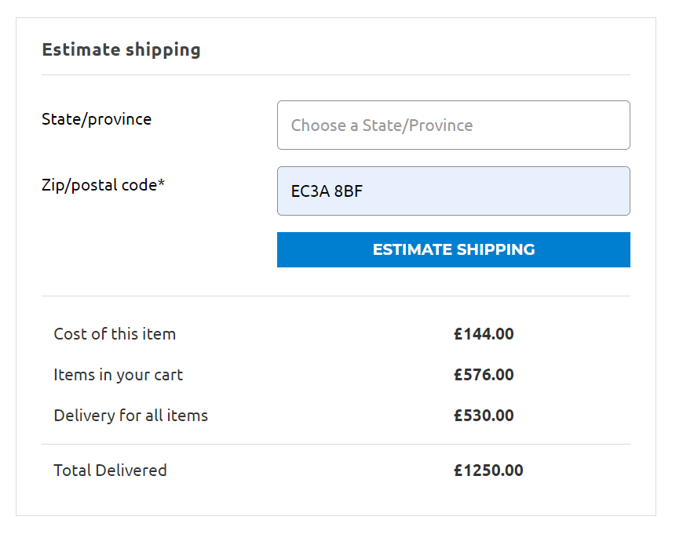

# Shipping Estimator on Product Page

**Demo 1:** Showing Country, State, City and Zipcode:



**Demo 2:** Showing State and Zipcode only:



## Install the script on your BigCommerce store

Go to **Storefront** > **Script Manager**, click **Create a Script**, choose:

- **Location on page** = `Footer`
- **Select pages where script will be added** = `All pages`
- **Script type** = `Script`

Enter the script below to **Scripts contents**: 

```html

 <script>
    window.jQueryTheme = window.jQueryTheme || window.jQuerySupermarket || window.jQuery;
    window.PapathemesShippingEstimatorSettings = {
        defaultCountry: 'Australia'
    };
</script>
<script src="//papathemes.com/content/shippingestimatoraddon/shipping-estimator.YOURDOMAIN.js" async></script>
```

**Note:** replace `YOURDOMAIN` by your own domain. Example:

```html
<script>
    window.jQueryTheme = window.jQueryTheme || window.jQuerySupermarket || window.jQuery;
    window.PapathemesShippingEstimatorSettings = {
        defaultCountry: 'Australia'
    };
</script>
<script src="//papathemes.com/content/shippingestimatoraddon/shipping-estimator.sinkwarehouse.com.au.js" async></script>
```

- `defaultCountry`: allows to set country selected by default.

### Hide country and city:

To hide country and city, set:

- `hideCountry: true`
- `hideCity: true`

See example below:

```html
<script>
    window.jQueryTheme = window.jQueryTheme || window.jQuerySupermarket || window.jQuery;
    window.PapathemesShippingEstimatorSettings = {
        defaultCountry: 'Australia',
        hideCountry: true,
        hideCity: true
    };
</script>
<script src="//papathemes.com/content/shippingestimatoraddon/shipping-estimator.YOURDOMAIN.js" async></script>
```

## Custom product form element selector for Supermarket and Chiara themes

**Supermarket** & **Chiara** themes support **Products Frequently Bought Together** feature built-in. You will need to specify different product form HTML element selector so that the shipping estimator can estimate your main product properly.

Insert `productFormSelector: '[data-also-bought-parent-scope] form[data-cart-item-add]'` into the configuration variable.

**Example 1:** Show country, state, city and zipcode:

```html
<script>
    window.jQueryTheme = window.jQueryTheme || window.jQuerySupermarket || window.jQuery;
    window.PapathemesShippingEstimatorSettings = {
        defaultCountry: 'Australia',
        productFormSelector: '[data-also-bought-parent-scope] form[data-cart-item-add]'
    };
</script>
<script src="//papathemes.com/content/shippingestimatoraddon/shipping-estimator.YOURDOMAIN.js" async></script>
```


**Example 2:** Show country and zipcode only

```html
<script>
    window.jQueryTheme = window.jQueryTheme || window.jQuerySupermarket || window.jQuery;
    window.PapathemesShippingEstimatorSettings = {
        defaultCountry: 'Australia',
        hideCountry: true,
        hideCity: true,
        productFormSelector: '[data-also-bought-parent-scope] form[data-cart-item-add]'
    };
</script>
<script src="//papathemes.com/content/shippingestimatoraddon/shipping-estimator.YOURDOMAIN.js" async></script>
```


**Example 3:** Install to Supermarket theme below Frequently Bought Together module on phragos.com:

```html
<script>
    window.jQueryTheme = window.jQueryTheme || window.jQuerySupermarket || window.jQuery;
    window.PapathemesShippingEstimatorSettings = {
        productFormSelector: '[data-also-bought-parent-scope] form[data-cart-item-add]',
        renderToSelector: '.productView-detailsWrapper',
        defaultCountry: 'United States',
        hideCity: true
    };
    (function() {
        var css = document.createElement('style');
        css.innerHTML = '@media (min-width: 801px) {'
        	+ 'div.PASE-shipping-estimator { float: right; clear: right; width: 50% }'
        	+ '}';
        document.head.appendChild(css);
    })();
</script>
<script src="//papathemes.com/content/shippingestimatoraddon/shipping-estimator.phragos.com.js" async></script>
```

**Example 4:** Use custom quotes template:



```html
<script>
    window.jQueryTheme = window.jQueryTheme || window.jQuerySupermarket || window.jQuery;
    window.PapathemesShippingEstimatorSettings = {
        defaultCountry: 'United Kingdom',
        hideCountry: true,
        hideCity: true,
        hideState: true,
        renderToSelector: 'div.productView-options',
        useCustomQuotesTemplate: true
    };
    (function() {
    	var style = document.createElement('style');
        style.innerHTML = '.PASE-shipping-estimator .estimator-form-row--total { padding-top: .75rem; border-top: 1px solid #ddd }';
        document.head.appendChild(style);
    })();
</script>
<script src="//papathemes.com/content/shippingestimatoraddon/shipping-estimator.central-uk.mybigcommerce.com.js?1" async></script>
```

